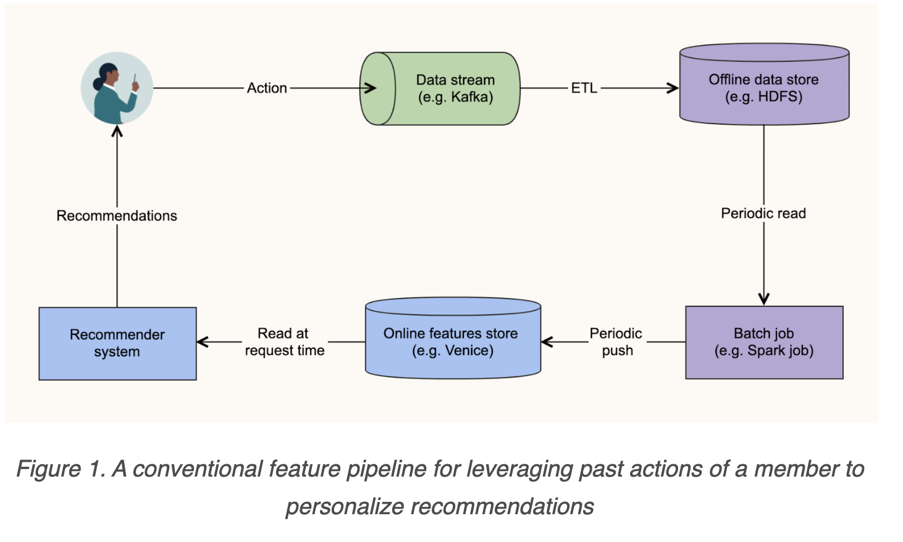

# Case Study - Near real-time features for near real-time personalization

* publish at 20220301
* data applications like
  * job the may be interested in.
  * member they may want to connect.
  * post they may want to interact.
* NOTE: the important entity in LinkedIn
  * users(members)
    * job seekers
    * job provider
  * company
  * jobs
  * articles (posts)
* make it in near realtime!

# batch 

Usually a delay between landing and get recommendations

</img>

latency : few hours to even days.

throughtput : high.

impact : we may lose some chance for the members.

tables : 

</img>

## Some idea

1. we only need to retain actions taken within the last dew days in the store. because features computed from actions should `complement` the features from batch. - `Lambda Arct`
2. rathan than pre-computed the features based on recent action. these features may be computed on demand
   1. computation is fast
   2. only a small amount of data needs to be processed for these features.
   3. aloows us to use the most recent actions for computing features.

## Review the feature building pipeline.


1. relevant action taken by a member over a duration of time(e.g. last 7 days)
2. look up certain attributes, such as embedding from interaction with a job/member.(or readable feature)
   * what job the user clicked in past 7 days.
   * the location of the job the used clicked in past 7 days.

3. perform aggregation, such as average of all the embeddings. --> online features

### Summary of requirements (Hard Constraint)

the computation pattern above helped us define the requirements for our desire solution.


Requirement 1 : ability to record any member action of interest within a few second.

Requirement 2 : ability to join any attributes of the entity on which an action was taken.

Requirement 3 : ability to retrieve actions taken by a member(along with joined attributes) that meet certian criteria and compute feartures from those action in less than 100ms.

* retieval criteria could be - job apply action s taken in the last N houes, N is no more than 24, when N > 24, batch processing will handle that.
* 100ms latency constraint ensures that recommendaqtions are served to a member after member take actions.

### Soft requirement

* simple, easy to adopt, and easy to maintain.
* allow us to leverage the same activity data across multiple recommender system.
  * average embedding of all the jobs that the member applied to in the last 24 hours.
  * connection recommender - average embedding past 6 hours
  * it should be able to do so with minimum effort.

### Define the data model of online store

* standard schema for representing **any member action.**

```python
{ 
  "actor": Integer, 
  "actorAttributes": JsonObject,
  "verb": String, 
  "verbAttributes": JsonObject,
  "object": String,
  "objectAttributes": JsonObject, 
  "timestamp": Long
} 
```

e.g. user **111** from **internet industry** **click job apply** via **mobile device**, the job is based on **new york**, and the embedding is **[0.1, 0.4, 0.9]** at timestamp **345678**

```python
{ 
  "actor": 111,
  "actorAttributes": {"industry": "internet"},
  "verb": "job-apply", 
  "verbAttributes": {"device": "mobile"},
  "object": "job:222",
  "objectAttributes": {"geo": "new york", "embedding": [0.1, 0.4, 0.9]}, 
  "timestamp": 345678
}
```

e.g. click on an article in the feed may be represented as 

```python
{ 
  "actor": 123,
  "actorAttributes": null,
  "verb": "feed-click", 
  "verbAttributes": null,
  "object": "article:333",
  "objectAttributes": {"topic": "web development"}, 
  "timestamp": 456789
}
```

## Desired Solution

</img>

* the stream processor should be limited processing logic to simple operations such as `filtering`, `stream-table joins`, and `projections` - the stream processor is always simple and lightweight.
* LinkedIn pick [`Apach Samza`](https://samza.apache.org/) to do the work

the process logic generally looks like the following

1. read an event corresponding to an action.
2. filter the event if the action is not worth recording (e.g. bot)
3. join any require attributes of the actor, verb, object of the action.
   1. the attributes may be stored in external stores(e.g. Venice store may contain attributes of each job, such as embedding / geographic location, ...)
4. emit a new event in to stand action schema shown above.
5. processed feature store in light-weight online store(they use Apach Point) (keep past N hours)
   1. means that an action is delete from the stire N hours after it is ingested - keep the size small.
   2. the data is partitioned and sorted based on the actor column (aloows quick retrieval of actions take by a specific member.)

</img>

#### Why choose [Point(for aggregation)](https://pinot.apache.org/)

1. support near realtime ingestion of data from kafka.
2. can answer analytical queries with low latency --> allow computation of variety od feature from activity data in the store in less than 100ms.
3. horizontally scalable.
4. support purging of old data.


```sql
SELECT objectAttributes FROM store 
WHERE actor = 111 AND verb = ‘job-apply’ AND timestamp > (currentTime - 24 hours)

```

```SQL
SELECT objectAttributes FROM store 
WHERE actor = 111 AND verb = ‘job-apply’ AND timestamp > (currentTime - 6 hours)
```

```sql
SELECT COUNT(*) FROM store 
WHERE actor = 111 AND verb = ‘job-apply’ AND timestamp > (currentTime - 24 hours) 
GROUP BY objectAttributes.geo
```

## Result

1. Member actions of interest can be recorded in the Poin store within 0.1s to 15s, depending on the freq of the type of aftion.
2. Actions can be retrieved in less than 50ms at a rate of over 20,000 qps
3. maintenance cost has been small

significant gains in business metrics.

</img>

</img>

</img>

WAU 0.03% --> actually translate to a large increase in the absolute number of members.

## Limitation

* this arct works well for members features, and (member,item) features
* may not work well for item features based on recent of all members(depends on batch system)

## What They Learned

* always test your assumptions
  * performing load test with real data and queires.
* elarly beats perfect - deploying the first few use cases to production revealed certain intricacies that we wouldn't have been able to foresee
* short developement cycle helps


## Summary

1. use lambda arct for a good start.
2. formatter, aggregator should be separated. - for maintenance
3. data size in speed layer could be small
4. simple features brings fast processing time.
5. linkedin build a `a record a time` recommendation in near realtime (100ms)


# Ref

[Near real-time features for near real-time personalization](https://engineering.linkedin.com/blog/2022/near-real-time-features-for-near-real-time-personalization)

[applied-ml star 21.2k](https://github.com/eugeneyan/applied-ml)