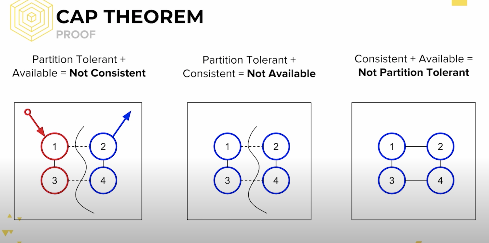

# CAP theorem

在理論計算機科學中，CAP定理(CAP theorem)又稱作圍布魯爾定理(Brewer's theorem) : 

對於一個分散式計算系統，不可能同時滿足以下三點

一致性(Consistency) - 等同於所有節點訪問同一份最新的資料副本

可用性(Availability) - 每次請求都能獲取到非錯的響應 - 但是不保證獲取到的資料是最新的

分區容錯性(Partition tolerance) - 系統如果不能在時限內達成數據一致性，意味著發生了分區(例如網路不通的兩個區域，或是網路通，但是目前尚無資料正在傳輸，都形成了pattition)

</img>

以下是三種場景 : 

</img>

1. P + A --> NO C
   1. 原本4個節點都是藍色(作者最喜歡的顏色)
   2. 事件發生，作者上了新的學校，喜歡的顏色從藍色轉呈紅色
   3. 向系統發出 update，由於右邊的兩個節點是分區，無法被更新，左邊的被更新了
   4. 有client向系統發出了請求，詢問作者最愛的顏色，基於可得性，但運氣比較差，選到了藍色
   5. 因此沒有了一致性

</img>

2. P + C --> No A
   1. 原本4個節點都是藍色(作者最喜歡的顏色)
   2. 事件發生，作者上了新的學校，喜歡的顏色從藍色轉呈紅色
   3. 向系統發出 update，由於右邊的兩個節點是分區，無法被更新，左邊的被更新了 
   4. 有client向系統發出了請求，詢問作者最愛的顏色，系統為了確保一致性，選擇了不回應任何結果
   5. 因此沒有了可得性

</img>

3. C + A --> No P
   1. 原本4個節點都是藍色(作者最喜歡的顏色)
   2. 事件發生，作者上了新的學校，喜歡的顏色從藍色轉呈紅色，沒有 partition，全部都被更新成紅色
   3. client 發出請求，詢問作者最愛的顏色，得到紅色
   4. 完美結果
   5. 但以上結果不可能再有 partition 的情況下發生

現實中更常發生的是，系統確定是有分區的，因此一致性和可得性必須選一個

# Ref

[CAP定理](https://zh.wikipedia.org/wiki/CAP%E5%AE%9A%E7%90%86)

[CS198.2x Week 1 CAP Theorem](https://www.youtube.com/watch?v=K12oQCzjPxE)
