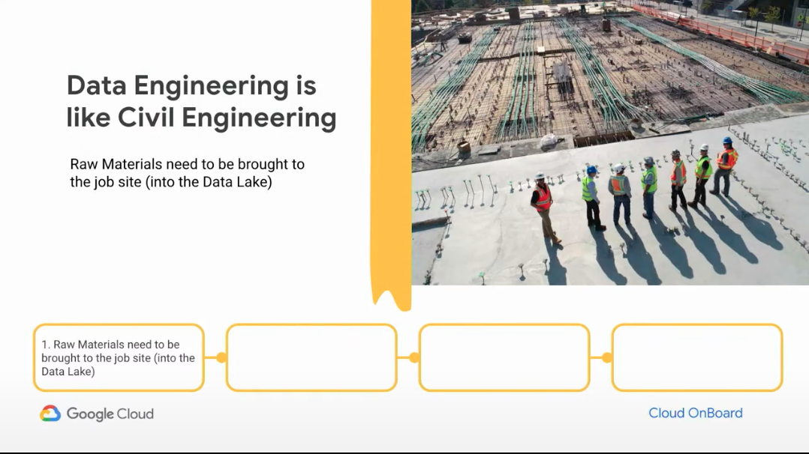
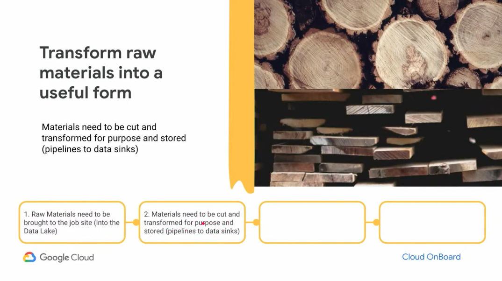
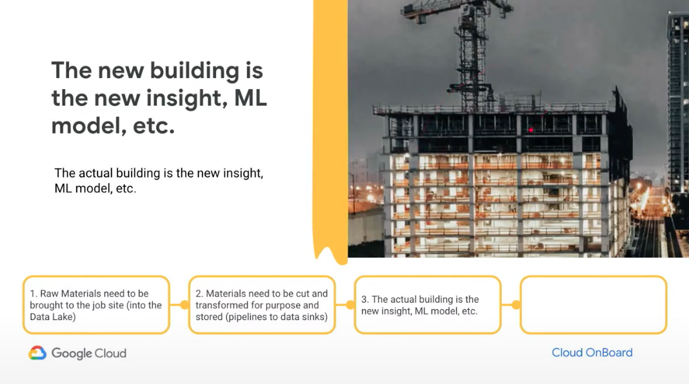
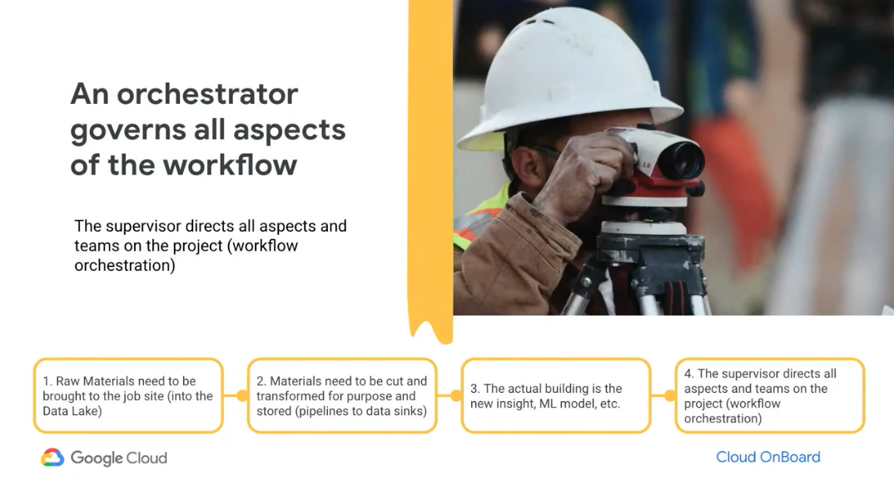

# 4 steps Data Engineering describe by google

</img>
</img>
</img>
</img>

1. Data Source(DB, crawler, api, ...)
2. Data Lake(tabular, articles, assets, model binary, ...)
3. Data warehouse(processed ready for analytics and modeling, the biggest one)
4. Data Mart(smaller, processed data for specific task)
