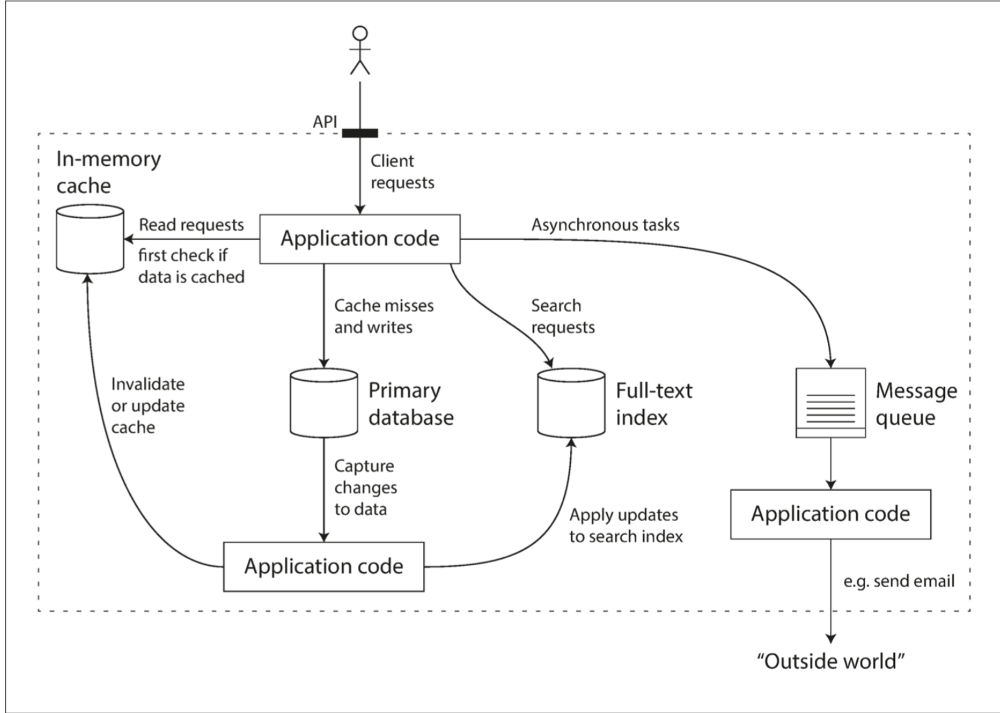
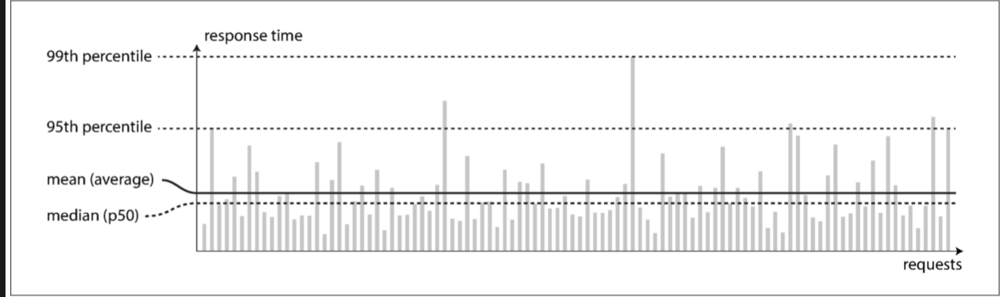
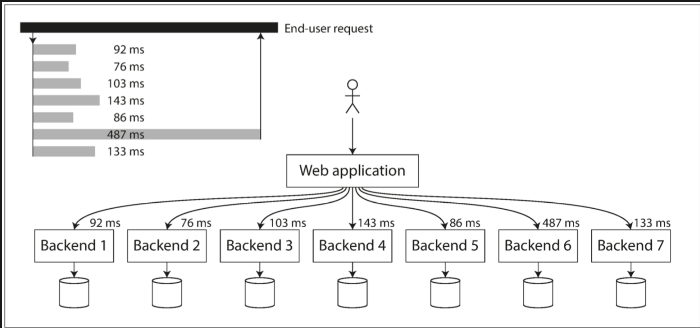

# Ref

book

[github](https://github.com/Vonng/ddia/blob/master/ch1.md)

# Intro

現今很多應用程式是資料密集性(data-intensive)，而非計算密集型(compute-intensive)，因為CPU很少成為這一類型的瓶頸，更大的問題通常來自於**資料量**、**資料複雜性**、**資料變化的速度**

資料密集型應用程式通常是由一些常見功能的標準模組構建而成，例如以下組件

1. 資料庫 (databases) : 儲存資料
2. 快取 (caches) : 將昂貴的計算結果儲存起來，使讀取操作更快
3. 搜尋索引(search index) : 試用者可以透過關鍵字來搜尋資料或是支援各種過濾資料的方式
4. 串流處理(stream processing) : 將訊息發送至另一個程序，且以非同步的方式進行處理
5. 批次處理(batch processing) : 週期性地處理大量資料

以上需求看起來很平常，是因為這些資料處理系統，有著很成功的抽象層(工程師不用重新寫一個資料庫)

但現實不總是那麼簡單，例如各種不同的資料庫就有不同的特性，本書會先探討實踐的基礎，**可靠、可拓展、可維護**的資料系統

# 資料系統思維

現今的應用往往有廣泛的要求，你往往需要搭配以上各種不同的組件來完善你的資料系統，例如以下架構

</img>

1. 由於希望可以降低 response time，將資料存取於快取層(利如Redis)，當client進入時，會先在這一層檢查有沒有資料
2. 如果在第一層沒有找到資料，那麼可能會進入主資料庫找資料
3. 或者 client 是透過一個搜尋 bar 在搜尋想要的物品，那麼使用者每打一個字，就會送出一個 requests 致 search index 進行搜尋
4. client 完成某些操作之後，可以繼續client自己的操作，然而後台必須送出一封信件至使用者的email

那麼以上系統的不同組建之間會存在**如何同步**，**規模化**的問題

# 可靠性

對於軟體，典型的期望有

1. 應用程式可以執行使用者所期望的功能
2. 能夠容忍使用者的錯誤或已不正確的方式操作軟體
3. 在預期的負載和資料性下，性能可以滿足需求
4. 系統能夠防止未經授權的訪問

容錯不等於可以容忍所有錯誤，而是對於常見的錯誤具有可以容忍性，具體的定義要看你的系統而定	

## 硬碟故障

硬碟壞軌、記憶體掛點、停電、拔錯網路線，任何一個與大型資料中心合作過的人都可以告訴你這很常見

pass

## 軟體錯誤

1. 2012年6月30，閏秒，Linux和心中的一個bug，導致可以透過特定輸入讓很多應用程式當機
2. 失控的process，造成共享資源(CPU, 記憶體, 硬碟, 網路頻寬)的異常消耗
3. 系統所依賴的服務變慢，沒有回應，或者開始傳回異常
4. 連鎖故障(先壞A，再壞B，再壞C)

導致這一類的軟體故障bug通常會潛伏很長一段時間，直到被特定事件觸發

## 人為失誤

人除了設計和構建系統之外，也負責維護系統，一項對於大型網路服務的研究發現，組態配置錯誤是導致系統崩潰的主要原因，軟體故障和硬體故障只佔了總體10~15%

那麼如何保證系統的可靠性?

1. 設計時就減少出錯機會 - 精心設計的抽象層、API、管理介面，可以很容易**做對的事情**，**不容易做錯的事情**，但如果介面限制太多，人們就會想要繞過它，這一點需要取得平衡
2. 將人們容易出錯的地方、引發故障的地方分開，提供一個功能齊全的sandbox(例如開發環境)，讓開發者可以在其中探索和嘗試，且避免影響到使用者
3. 在所有級別進行測試(單元測試、系統整合測試、手動測試)
4. 可輕鬆快速的從人為錯誤中修復(快速回滾的組態變更、滾動發布程式碼、提供資料校驗工具)
5. 建立詳細的監控系統(包含性能指標和錯誤率)
6. 實踐良好的管理實踐和培訓
   
## 可靠性有多重要

商業應用系統的bug會讓生產力下降，甚至因資料報告錯誤帶來法律風險

網站當機會造成營收和聲譽損失

# 可擴展性

就算系統今天可以正常工作，不代表明天也可以。
導致性能下降的常見原因就是系統負載增加，系統從原先的10000個併發使用者提升到了10萬個，或從10萬個提升成1000萬個，又或者系統要處理的資料量比起過去多了很多

可擴展性這個術語用於描述系統應對負載增加的能力

但如果說 X 是可擴展的，Y是不可擴展的，並沒有太大意義，反而應該像下面這樣考慮

如果系統以某種方式成長，我們有哪些應對方式?

我們應該如何增加運算資源來處理額外的負載?

## 描述負載

我們必須能夠簡潔地描述系統當前的負載，才能進一步討論增長的問題

這些數值我們稱之為 負載參數(load parameters)，像是

1. Web伺服器的每秒請求數量
2. 資料庫的讀寫比例
3. 聊天室的同時使用者活躍數
4. 快取命中率

或許對你來說，最重要的是一般平均情況，又或者你所面臨的系統瓶頸是來自於少數的極端情況

Tweeter 例子 pass

## 描述性能

### The real question

描述了系統負載後，就可以開始研究負載增加的情況，這可以從兩個面向來看

1. 當負載增加，但系統支援不變(CPU、記憶體、網路頻寬等)，系統性能會受到什麼影響?
2. 當負載增加，如果要保持性能不變，需要增加多少資源?

評估這兩個問題都需要性能指標，因此我們來看一下怎麼描述系統性能

### offline / online

1. 在Hadoop的批次處理系統中，我們通常關心吞吐量(throughput)，即每秒可處理的記錄數量，特定大小資料集上執行錊夜所需要的總時間
2. 對於線上服務來說，服務回應時間(response time)通常更加重要

回應時間(response time) 和 延遲(latency) 往往因為混用而早成混淆，他們並不完全相同

回應時間 : 客戶看到的，除了實際服務時間之外，還包含網路延遲和排隊延遲

延遲 : 一個請求等待被處理的時間

</img>

上圖中，橫軸是 request id 縱軸則是 response time 

可以看到的是，有些回應的快，有些回應的慢

因為過程中會存在一些隨機延遲(造成回應時間有小幅度的變動) : 後端程序的上下文切換，網路封包遺失，TCP重傳，垃圾回收暫停等等

也會有一些異常值 : 可能上述情況全部一起發生了，或是有其他很特別的情況

平均情況 - 考慮平均值 or 中位數

極端情況 - 考慮 95分位數 99 分位數

高百分位數的回應時間也稱作尾延遲(tail latencies)，他們直接影響了使用者對服務的體驗

例如 Amazon 使用 p99.9 來描述回應時間要求，因為請求最慢的客戶通常是那些已經採買許多商品的客戶 ; 也就是說，他們是最有價值的客戶

確保網站的速度讓這些客戶感到滿意是很重要的

Amazon 也觀察到回應時間每增加100秒，銷售額就會少1%，客戶滿意度減少16%

另一方面，如果要最佳化 p99.9，有人認為代價太高，對Amazon的商業目標來說並沒有產生足夠的收益

### SLO, SLA
然而服務可用性的具體描述文件(合約、協議)，會稱作Service Lovel Objectives (SLO) or service level argreement(SLA)，即服務預期性能

SLA 可能會聲明，如果

1. 回應時間中位數 < 200 ms
2. 99百分位數< 1s

那麼服務屬於正常工作，反之就認為該服務不達標

這些指標讓客戶(PM)有了期望值，並允許客戶在SLA未達標的情況下要求退款

### Tail Latency Amplication

Tail Latency Amplication : 尾部延遲放大

在多重調用的後端服務中，即使是平行處理，但client端最終仍然要等待最慢的程式完成，在量測上以長條圖來描式能夠相對準確的監控這一類延遲

</img>

## 應對負載壓力的方法

在某個等級的負載架構不太可能應對高10倍的負載。如果你正在開發一個快速成長的服務，那麼每次負載發生數量極的成長時，你可能就需要重新考慮架構

人們經常討論兩種可規模性方法(Scaling) -  

1. 垂直擴展(vertical scaling, scaling up) - 單機但更強的機器
2. 水平擴展(horizonal scaling, scaling out) - 多機但更小的機器

在單台機器上運作的系統通常更簡單，但高級的機器可能很貴，所以非常密集的負載同長無可避免地需要水平擴展，現實世界中的優秀架構通常需要將兩種方法務實地ㄏ結合，因為使用幾台足夠強大的機器可能比使用大量的小型虛擬機更簡單也更便宜

有些系統是彈性的，這意味著自動偵測負載參數，並且做自動化的垂直擴展/水平擴展(GAE, autoscaling)

如果你的服務屬於無狀態服務(中間不需要存取任何變數)，那麼跨多台機器就會非常簡單，反之，則會引入許多複雜度

一個良好的可擴展架構是圍繞著假設建立的

1. 哪些操作是常見的
2. 哪些操作是罕見的

以上就是所謂的負載參數

如果假設最終是錯誤的，那麼為了擴展所做的工程就白費了，在早期創業的公司中，支援產品快速迭代的能力要比可擴展至未來的假想負載要重要的多

# 可維護性

軟體大部分的成長並不是在開發階段，而是後續的維護，包含修復bug，維持功能正常，故障排除，適應新平台，添加新的使用案例，償還技術債等等

基本上可以從以下觀點切入可維護性

1. 簡單性 - 系統複雜度，讓新接手的工程師可以更容易地理解系統
2. 可演化性 - 讓工程師可以輕鬆地改進系統，在需求發生變化時可以調整系統

## 朝無痛維護邁進

優秀的維運團隊大概上需要複雜以下工作

1. 監控系統的健康狀況，並在服務出狀況時快速恢復服務
2. 追蹤問題的原因，例如系統故障or性能下降
3. 更新軟體和平台，包含安全性修補
4. 密切關注不同系統之間的相互影響，以避免有問題的修改損壞系統
5. 預測未來可能的問題，並在問題發生之前解決他們
6. 為部署、配置管理等，建立良好的實踐和工具
7. 執行複雜的維護任務，例如將一些應用程式從一個平台遷移到另一個
8. 系統配置發生變更時，保持系統的安全性
9. 定義作業流程，使操作具備可預測性並且幫助生產環境穩定
10. 保留組織在建立系統時所保留的知識，使系統不因為單獨個人的去留而受到影響

好的維護性意味著令日常工作更加簡單，使得團隊可以將精力放在高價值的活動
通常會對資料系統做以下設計

1. 監控系統，為系統的行為提供可見性
2. 避免對特定機器的依賴(系統不間斷服務時，也能進行維修)
3. 提供良好文件和易於瞭解的操作模型(做了X一定會發生Y)
4. 提供良好的預設行為，但保留手動控制的權限
5. 表現出可預測的行為，盡量減少意外的發生

## 簡單性 : 掌握複雜度

1. 盡可能清楚，不過於冗長的說明(or 變數名稱)
2. 足夠清楚的抽象，例如SQL，它隱藏了複雜的磁碟和記憶體資料結構、來自其他客戶端並發的請求，blablabla

## 可演化性

通常系統都是不斷變化的，和需求一樣 e.g.

1. 新的做法
2. 新的使用案例
3. 新功能
4. 新的平台交替
5. 法規變動
6. 架構調整

組織文化層面 : Alige

TDD, 單元測試, 重構

# 小結

本節介紹了一些對資料密集型應用的基本思考原則

1. 功能性需求(該系統該做的事，e.g.以不同的方式完成資料儲存、讀取、檢索、...)
2. 非功能性需求(安全、可靠、合規、可擴展、相容、可維護)
   1. 可靠性 - 系統有部分故障仍然可以工作，故障可能是硬體、軟體、人為
   2. 可擴展 - 當負載增加時，系統具有維持性能的策略，首先必須描述負載和性能(定量)
   3. 可維護 - 邁向無痛(容易修改、重構、新的工程師容易理解)
