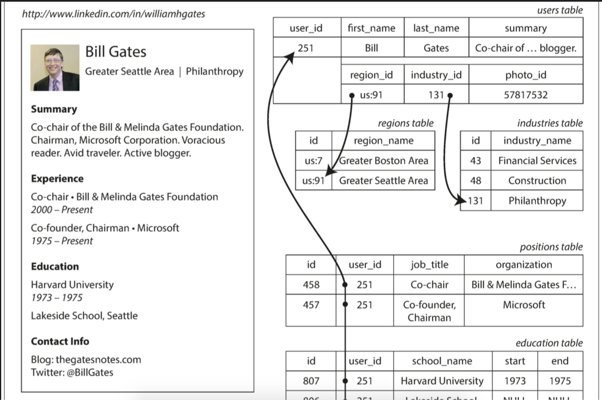
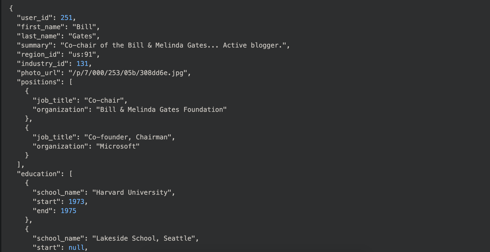
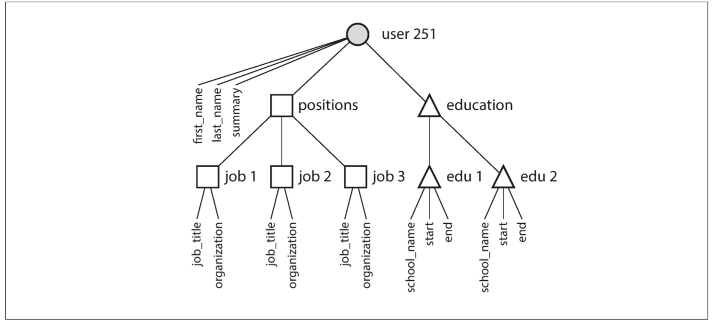

# Ref

book

[github](https://github.com/Vonng/ddia/blob/master/ch1.md)

# Intro

資料模型可能是軟體開發當中最重要的問題，不僅影響軟體的編寫方式，還有我對於待解問題的思考方式

1. 資料的結構通常是由具體的應決定
2. 當需要儲存這些資料結構時，可採用通用的資料模型來表達他們
   1. JSON/XML - 文件(document)
   2. 關連式資料庫的表(Table)
   3. 圖(graph model)
3. 建構資料庫的工程師會決定用JSON/XML/realtional/graph資料來表示來自記憶體、磁碟、網路上的資料，以便更容易的查詢搜尋、聚合等處理

# 關聯模型 vs 文件模型

### 關聯模型(Relational Model)
1. 1970 Codd 提出，資料以**關係**被組織起來
2. 大量使用在
   1. 交易處理(transaction processing) - 銷售紀錄、銀行交易、訂機票、倉儲管理
   2. 批次處理(batch processing) - 客戶發票、薪資單、報表

### NoSQL

1. 其實不是一個具體的技術，他當初只是一個在Twitter上引人注目的標籤(2010) - Not Only SQL
2. 採用NoSQL背後有幾個驅動因素
   1. 需要比relational model更容易實現擴展性，包含支援超大資料集、超高寫入吞吐量
   2. 開源
   3. Reational Model 所不能良好支援的特殊查詢
   4. realtnional model 限制太多

在可見的未來，relational database 會持續和各種非關聯式資料庫整合在一起

### 正規化

Relational model 當初設計時儲存空間昂貴，且有些資訊統一管理更好維護(容易維護是一個重要原因)，因此出現了正規化的設計方法，將重複的資料收集在一張表，並且使用JOIN的方式來取得完整資料

</img>

### 物件 - 關聯不匹配

現今多數應用系統採用物件導向的程式語言來開發，然而關聯模型隨著查詢語言SQL一起被提出，這就引發了對SQL的批評

應用層和資料庫模型之間會需要一笨拙的轉換層，而開發者們稱之為關聯映射(Object-realtional mapping, ORM)，雖然他們建立了部分對應關係，但還是無法完全隱藏兩個模型之間的差異

SQL標準的後續版本也增加了對複雜型態資料的支援(XML, JSON)，Oracle, IBM DB2, MS SQL Server, PostgreSQL, MySQL都做了部分的支援

## 文件模型
然而履歷這種資料，每一個履歷就像是一個文件，使得JSON儲存非常方便，JSON吸引人的地方在於，它比XML要簡單得多，文件導向的資料庫(MongoDB, RethinkDB, CouchDB, Espresso)都支援JSON

</img>

一次把整個樹狀結構載入，就不用一直做JOIN來取得一個人的所有資料

</img>

JSON model 有更好的局部性(讀取一個屬性只需要再入該文件)，relation model 則是要join不同的表格，一次得到所有人的屬性在選出來

# 文件模型中的靈活性

Document databases 有時候被稱為 schemaless 資料庫，但這個說法可能會誤導人，更準確的術語是 shcema-on-read(資料結構是隱式的，只在讀取資料時得到詮釋)，相對應的則是 schema-on-write(schema是顯式的，資料庫會確保所有寫入的資料都符合shcema規範)

schema-on-read 有點像程式語言的動態類型檢查

shcema-on-write 則是像程式語言中的靜態類型檢查

兩者到底哪個比較好也是長期以來的爭論話題

# 哪種資料模型會讓程式碼更簡潔

1. 如果應用程式中的資料具有 document-like 的結構(一顆一對多關係的樹)，那麼使用 document model 可能會更好，relational model 中的分解(shredding)技術會把 document-like 的結構分割為多個Table，這可能會導出較不直覺的schema
2. Document model 也有一些限制，例如不能直接引用 document 的嵌套項，而是需要說出類似 "user521職位清單中的第2項" 的這種內容，然而只要 document 沒有嵌套的太深，這通常不是問題
3. Document model 對joins的支援不足可能是個問題，也可能不是，這取決於使用方式，例如一個分析使用了documnet database 來記錄何時發生什麼事，像這樣的情況就永遠不會用上多對多關係
4. 對於高度關聯的資料，document database就顯得笨拙，relational database可以勝任，而graph model則是最自然的

# 查詢語言

pass

SQL, 關聯代數, map reduce query

# Graph-like

# 小節