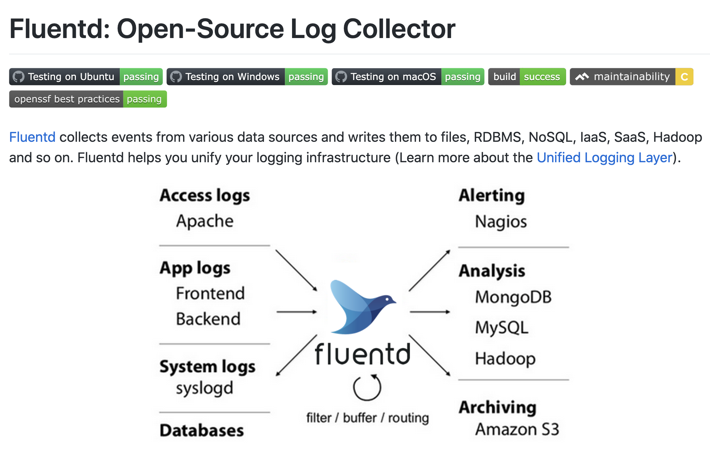

# Ref

[號稱下一代日誌收集系統！來看看它有多強 - Fluentd 20210617](https://www.gushiciku.cn/pl/gGw5/zh-tw)

* 收 log, 處理, 分析，常見的以 ELK 組合 (Elastissearch + Logstash + Kibana)
* Filebeat - 後期出現的，和 Logstash 相同，但更加輕量，佔用系統資源更少
* fluentd 比 logstash 效能更好， ELK 逐漸走向 EFK

# Fluentd

[github](https://github.com/fluent/fluentd)

[fluentd - unified logging layer](https://www.fluentd.org/)

* 免費
* 簡化 log 收集、處理、儲存
* 也有 GCP 對應的 plugin

</img>

* JSON 來紀錄 log
* 靈活的外掛 - MongoDB, Redis, CouchDB, S3, SQS, GCP, ...
* 最小所需資源 - C, Ruby - 1 processor, 30-40 MB memory - 13000 qps
* 可靠性 - 基於記憶體/檔案的資料緩衝

## Config

```
source   #輸入源，資料的來源
match    #確定輸出目的地
filter   #確定事件處理管道
system   #設定系統範圍的配置 
label    #對內部路由的輸出和過濾器進行分組  
@include #包括其他檔案
```

dtypes

```
string：字串，最常見的格式
integer：整數
float：浮點數
size 大小，僅支援整數
  <INTEGER>k 或 <INTERGER>K；
  <INTEGER>m 或 <INTERGER>M；
  <INTEGER>g 或 <INTERGER>G；
  <INTEGER>t 或 <INTERGER>T。
time：時間，也只支援整數；
  <INTEGER>s 或 <INTERGER>S；
  <INTEGER>m 或 <INTERGER>M；
  <INTEGER>h 或 <INTERGER>H；
  <INTEGER>d 或 <INTERGER>D。
array：按照 JSON array 解析；
hash：按照 JSON object 解析。
```

### Plugin

https://www.fluentd.org/plugins/all

1. aws - s3
3. gcp - pubsub
2. es
4. aws - ec2
5. aws - es
6. kafka
7. gcp - gcs/gbq
8. bigquery(stream insert)
9. gcs
10. slack
11. rabbitmq
12. mysql
13. ... 100+


# Arct

* fluentd
* GKE (fault tolerance, auto scaling)
* setup customize fluentd docker images
  * `docker pull fluent/fluentd:v1.14-debian`
  * write your own dockerfile
  * docker build images from dockerfile (the images should save in gcs or whatever your gcp can get it)
* kubernetes environment
  * create cluster on gcp
    * set nodes
    * set machine types
    * set IAM
    * set network
    * set `kubctl` in your local machine / work station
  * deploy fluentd on GCP
    * deployment
    * ingress & service
  * 壓力測試
  * In general
    * loading balancer (assign log to machine)
    * worker (data forwarding to destination)

## How to use

### GCS

```
curl -X POST -d 'json={"title":"板橋美食","url":"https://example.pixnet.net/blog/"}' http://abc.company/gcs.service_A
```

```
gs://datalake/service_A/year=yyyy/month=mm/day=dd/slice-hh-mm-json.gz
```

### GBQ

add schema in gcs://bq_schema first
```
curl -X POST -d 'json={"title":"板橋美食","url":"https://example.pixnet.net/blog/"}' http://abc.company/bq.example
```