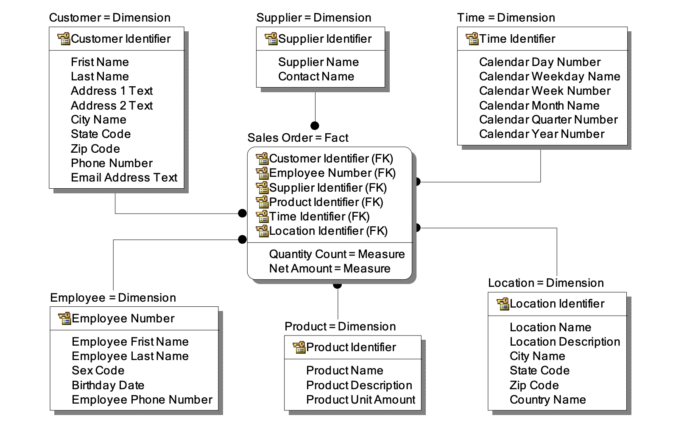
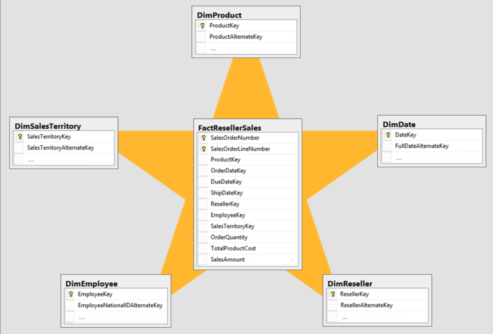

# Ref

[資料前處理之ETL概念介紹(1/6)](https://ithelp.ithome.com.tw/articles/10218522)

[淺談維度模型 (Dimensional Model) ](https://pk-group.weebly.com/uploads/6/1/2/6/61266765/2015-12-20_dimensional_model.pdf)

[資料倉儲](https://zh.wikipedia.org/wiki/%E8%B3%87%E6%96%99%E5%80%89%E5%84%B2)

# Dimensional Modeling (Star Schema)

* 是一種設計資料倉儲的思考模式(不是唯一一種)，由 Ralph Kimball 在 1996提出
* 兩種表格 - Fact, Dimension，一組 facts 與多組 dimension，圖示看起來像星星，又稱星狀綱要(star schema)
</img>

## Fact (Events)

* 通常是從一個事件(交易)中獲得的測量(例如銷售額、點擊、曝光等等) a.k.a 被分析的對象
* 透過 Forigen key 和其他維度表連結 (customer_id, employee_id, product_id, datetime_id, location_id)
* 一張事實表只能存在一種顆粒，不同資料顆粒不要放在一起，不能比較
* 越精細的顆粒度表示可分析的彈性，同時也代表越大的儲存成本
* metrics usually change over time, and need a time-unit like event_timestamp, event_date, ...
* Usually immutable (or very hard to)

## Dimension (Entity)

* 描述特性 - 人、事、時、地、物 - a.k.a 分析的根據
  * 例如上圖 - 產品表，員工表，地區表
  * 產品表又可以分層級
  * 人又可以分供給者、顧客等

* 拿來做 grouping, filtering, features
* 維度表如果是有階層性的，就可以下鑽或是上捲來查看不同層次的指標，越完整的維度屬性可以轉換成越完整的分析能力

* Forigen Key 需要對應到 Primary Key (usually some id like customer_id, product_id, ...)
* Usually Mutable

## STAR schema

* 一組 Dimension & Facts 經常會長得像是星狀架構
* 最常用，分析方便，儲存空間與分析便利性的權衡

## SnowFlake schema

* Dimensional Table 在拆細成更小的 Dimension table
* 不常用，因為分析麻煩，極緻化 --> 就是所謂的資料正規化

### Measure
* Fact 中的測量值，例如銷售金額
  * 企業希望如何分析車子銷售事實的信息，「讓我看看上週 (時間) 小車(物件) 在西部地區 (地區) 的銷售金額 (測量) 。」

**性質**

* 可累計的(Additive)，例如銷售額，可以計算區域內所有店家銷售額
* 不可累計(Non additive)，例如溫度，溫度加總沒有意義，但平均溫度有
* 半累計(Semi Additive)，有些維度加總有意義，有些沒有，例如結餘額

# 設計

* 選定一個場景
* 宣告資料顆粒度
* 找出維度表、事實表
* 確定雙邊資料庫的技術
* 開始做同步資料，建立資料倉儲

# Functional Data Engineering
[How to build a Recoverable & Reproducible data pipeline](https://www.dataengineeringweekly.com/p/functional-data-engineering-a-blueprint#%C2%A7functional-data-engineering)

Simplest way to design your data model for modern data warehouse.