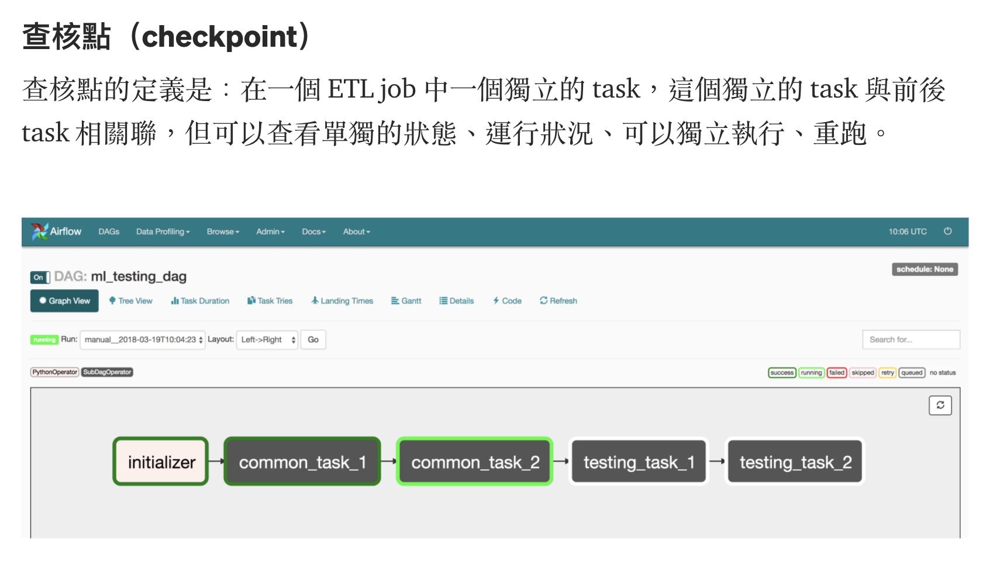

# checkpoint, security, account

## checkpoint

</img>

* usually use airflow to build checkpoint
* each task? - task 是彼此獨立的就切開
* 壞掉重跑時比較方便

# Security

1. 使用者介面 
   - airflow 不能直接刪除 job
   - jenkins --> 可以直接刪除 job，要小心

2. job runner - 實際執行 etl 的環境(k8s, spark, ...)
   - 因為要直接寫入資料、讀取資料，所以通常不會開放給使用者，只會開放從公司或是特定內部連線
   - 連線管理
     - user > UI > Job Runner > Database 
     - user > UI > MetataDB

## 帳密管理
1. use env variables

# Ref

[[Data] Data Pipeline 101（七） — 查核點、安全性、帳密管理](https://medium.com/bryanyang0528/data-data-pipeline-101-%E4%B8%83-%E6%9F%A5%E6%A0%B8%E9%BB%9E-%E6%AC%8A%E9%99%90-%E5%B8%B3%E5%AF%86%E7%AE%A1%E7%90%86-101810f8e575)