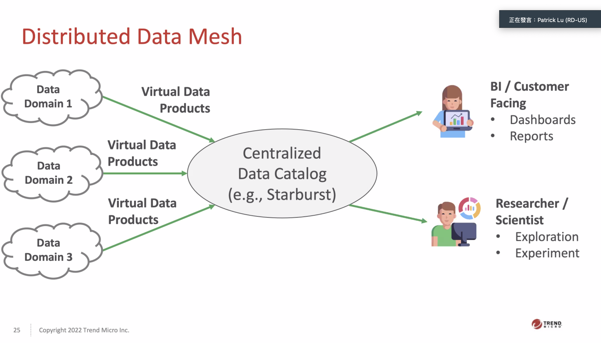

# Ref

[https://zh.wikipedia.org/wiki/%E8%B3%87%E6%96%99%E5%80%89%E5%84%B2](https://zh.wikipedia.org/wiki/%E8%B3%87%E6%96%99%E5%80%89%E5%84%B2)

[BI、數據倉庫、數據湖和數據中台有什麼差異？](https://kknews.cc/zh-tw/tech/v3a2a6y.html)

# Data Warehouse

資料集散地

* 主題導向 - 按照分析需求制定
* 整合性 - (從各個OLTP)整合過來
* 時間差異性 - 可以記錄資料庫的 snapshot，可以反映資料隨時間的軌跡
* 不變動性 - 寫入後不會被取代或是刪除(即時是錯誤的資料 <-- 可用於 bug 的追蹤)

業界經常使用 BigQuery, MySQL, AWS 上等價的 OLAP 作為資料倉儲

# Data Lake

* 可以包含資料倉儲
* 半結構化資料也可(CSV，XML，JSON)
* 非結構化資料也可以塞(電子郵件、檔案、PDF)
* 二進位資料(圖像、音訊、影片)

業界常使用 Hadoop, Azure 資料湖泊, Amazon Lake Formation's 等做法來實現資料湖

# 資料中台

背景 : 各個部門擁有自己的資料倉儲，無法整合起來，變成各大資料孤島

將各個資料倉儲透過網路打通，並對外設計API，整個系統則被稱為一個資料中台

資料中台如同資料倉儲、資料湖一樣，是一個概念，不是一個實體，需要各種技術去實現它

# Data Mesh

* terms
  * data swamp (資料沼澤 --> 資料湖裡面都是爛東西)
  * data silo (資料孤島、大家都有自己的資料倉儲、資料湖，沒辦法互通，組織越大越會出現)

# Data Challenges in Trend Micro

# Challenges in Data Lake

# Data Mesh

# Data Catalog

# Third party solution

# Data Mesh PoC

# Take aways

# Contact

* 一個好的說法，請問在做是不是也有人在做 Data Mesh，我也想要和大家學習
* 尋找有作 Data Mesh 的人，請他們 raise your hand.

