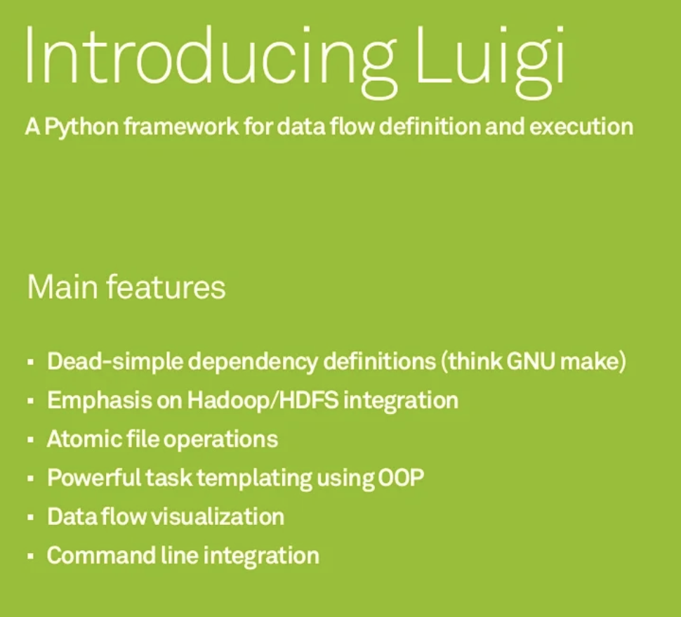
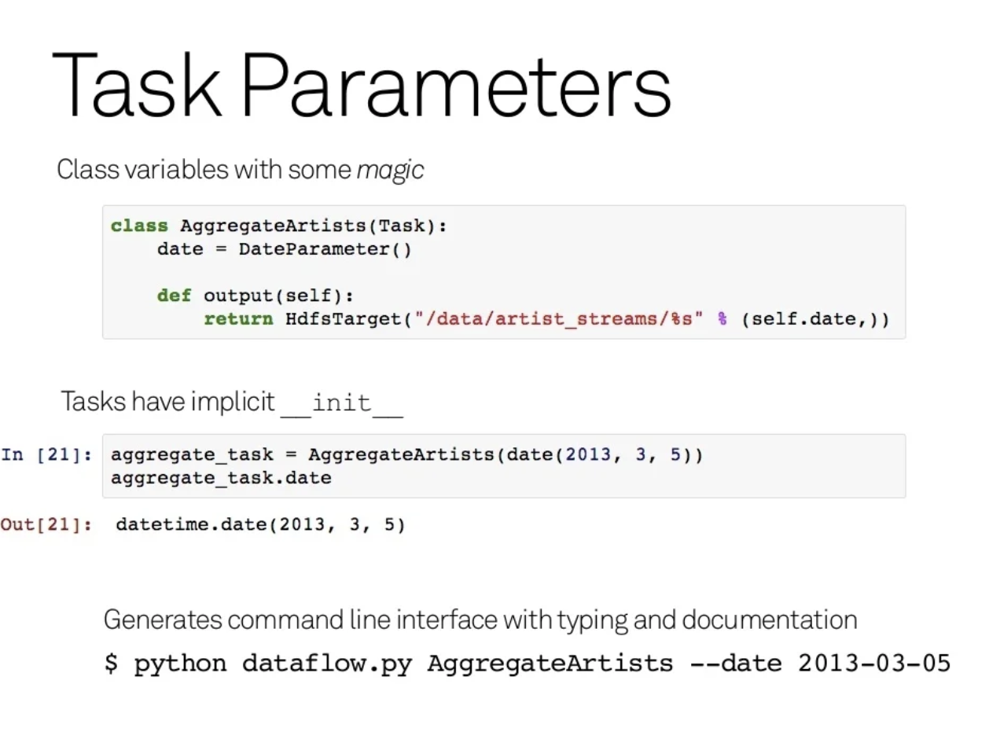

# ETL Developement.

1. 設計原型
   1. POC - 確認商業邏輯和資料是可行的在做後續開發(such as SQL, spark sql, pandas, ...)

2. 變數設置 
    - database / table - 對於 ETL, database, table 名字很容易跟著部署環境和階段開變，透過變數來管理會更方便
    - 連線方式 - same, stage/prod env
    - where condition - 每次只有搜尋條件不同
3. 測試
   - unit test - etl job test. 
   - integration test - mulitple etl job
   - staging env test - 環境近似生產環境，是否能在預定時間產出，運算資源是否足夠

4. 部署 - 避免資料在意外情況下污染到正式環境的資料 
   - source data : staging, destinition data : staging 
   - source data : production, destinition data : staging
   - source data : production, destinition data : production

5. 監控
   - 資料面 : input 資料量，output 資料量，關鍵統計值
   - 資源面 : 環境資源夠不夠(計算資源、儲存硬碟資源、或是queue是不是塞車)? 不同排程運算衝突時會不會運算失敗 

# Design pattern in ETL

Motivation : MVC

Model - data model

view - transformer 

controller - orchestrator

MVC(Model, View, Controller) --> DMTO(Data Model, Transformer, Orchestrator)

</img>

object|functionality|example
-----|-----|-----
data model|1. extract and load of all data <br> 2. direct communication with data source/stores|1. db query <br> 2. raw file copy <br> 3. model IO
transformer|1. data manipulation & generation <br> 2. accepts and returns data from/to the orchestrator|1. cleansing/formatting/datetime conversion <br> 2. feature engineering <br> 3. model training / inference
orchestrator|1. passing data between the data model and transformer in a sequence <br> 2. direct communication with data model, transformer and orchestration service|1. Instantiate data model and transformer classes <br> 2. Call public func in data model or tranformer class in correct sequence <br> 3. get environment variables.|

Orchestrator 

</img>

Data Model

</img>

Transformer

</img>

In Practice


role|func|
-----|-----|
Orchestrator|airflow|
Data Model|metadata abstract class|
Transformer|pyspark sql / sql / pandas / flink / ...|

```python
class SomeTask:
    def inflow(self):
        return inflow_a, inflow_b
    def outflow(self):
        return outflow_a
    def run(self, inflow_table_a, inflow_table_b):
        inflow_a, inflow_b = self.inflow
        inflow_table_a = inflow_table_a or inflow_a.load()
        inflow_table_b = inflow_table_b or inflow_b.load()
        
        outflow_table = (
            inflow_table_a.join(inflow_table_b)
        )
        
        return _publish(outflow_table)
```

## Case Study - Luigi from Spotify(2013)

[What are some good books/resources to learn about designing ETL frameworks?](https://www.quora.com/What-are-some-good-books-resources-to-learn-about-designing-ETL-frameworks)

> This is a tough question.
> Most ETL frameworks are a key component to any tech company success and thus the lack of documentation.
> That being said, Spotify had its ETL framework, luigi[1], open-sourced. I suggest browsing the code to get more familiar with the design and architecture and hopefully get inspired.


[Luigi PyData presentation](https://fr.slideshare.net/EliasFreider/luigi-pydata-presentation)


</img>

</img>

</img>

</img>

</img>

</img>

</img>

* 2013 可能還沒有 airflow, 現在有了

</img>

</img>

</img>

</img>

</img>

</img>


[spotify/luigi](https://github.com/spotify/luigi)

# Hints in ETL 
1. always knowing about your data warehouse
   1. what is the end system doing?
   2. what does it support?
   3. how are end users interacting with it.

2. copy raw source data - don't pre-manipulate it, cleanse it, mask it, convert data types or anything else.
   1. premissions - source system is typically not one you control - can't be guaranteed from one execution to the next - use **Gaurd operator to make sure source data is matched requirement**
   2. impact - excessive step in the extract process make potential error when source data changed.
   3. debugging / troubleshooting - help you identify and resolve issues faster when source data changed.
   4. **NOTE - it may seem convenient to start with transformation. howerver in the long term run, it will create more work and headaches.**

3. Triage the data (將髒數據分類出來)
   1. less unknown bug in the downstream task.
   2. label the bad data by `flag` instead of filter it out. also add bad data reason column. to help future yourself to diagnosis the bad data.

4. through n transformation
   1. taske it step by step - make it as simple as possible to debug with
   2. be consistent - consistent and meaningful naming conventions to help other developer to understand your logic.
   3. NOTE that with "why", not just the "what" - we know it's a join, but why you use outer join?

5. Time to publish
   1. rename columns, select columns which fits the demand.

# Ref

[[Data] Data Pipeline 101（八） — ETL Job 開發流程](https://medium.com/bryanyang0528/data-data-pipeline-101-%E5%85%AB-etl-job-%E9%96%8B%E7%99%BC%E6%B5%81%E7%A8%8B-f29e883744b5)

[DMOT: A Design Pattern for ETL — Data Model, Orchestrator, Transformer](https://towardsdatascience.com/dmot-a-design-pattern-for-etl-data-model-orchestrator-transformer-c0d7baacb8c7)


[Building an ETL Design Pattern: The Essential Steps](https://www.matillion.com/resources/blog/building-an-etl-design-pattern-the-essential-steps)