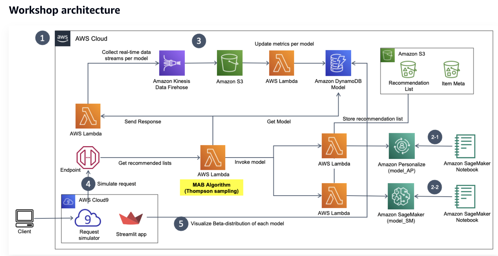

# Overall

1. Model Inference - Endpoint by aws sagemaker or something like that
2. traffic switcher - lambda (aws) / cloud func (gcp)
3. interaction data - s3 (aws) / gcs (gcp)
   1. 2 buckets - batch, stream (follow lanbmda arct)
4. metrics aggregation
   1. batch - pyspark, emr (aws) / dataflow (gcp)
   2. realtime - flink/pandas, emr / dataflow

# SageMaker

1. SDK
2. build up container and scale up all of the thing
3. infra as code (instance size, endpoint name, etc)
4. similar tool open sourced - bentoML