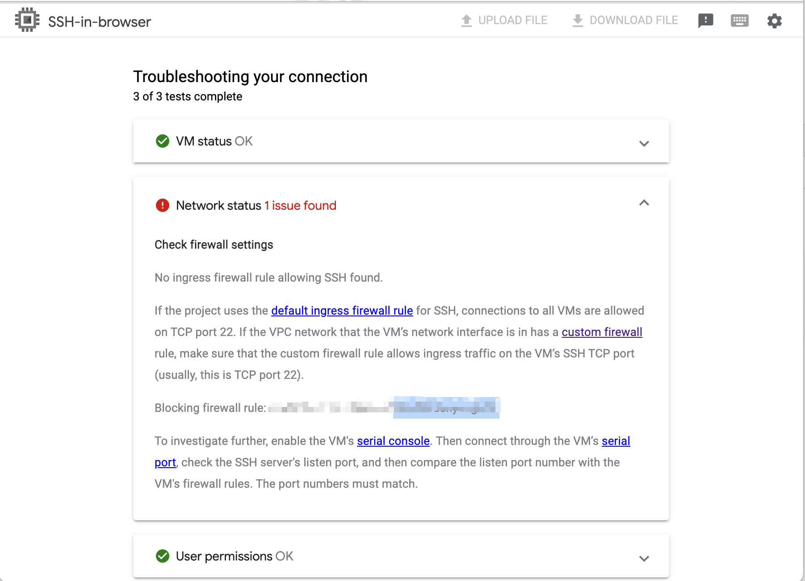

# Installation

https://cloud.google.com/storage/docs/gsutil_install


# Words

| command  | what is it                 | note             |
|----------|----------------------------|------------------|
| `gsutil` | `google storage utils` | 用於管理gcs資源，例如建立bucket，列出bucket等    |
| `gcould` | `google could shell tools` | 用於操作gcp專案資源 |

[Google Cloud Shell 入門：gcloud & gsutil](https://titangene.github.io/article/getting-started-with-cloud-shell-gcloud-and-gsutil.html)

# gcloud

`gcloud components list`

```
Your current Google Cloud CLI version is: 419.0.0
The latest available version is: 419.0.0

┌────────────────────────────────────────────────────────────────────────────────────────────────────────────────┐
│                                                   Components                                                   │
├───────────────┬──────────────────────────────────────────────────────┬──────────────────────────────┬──────────┤
│     Status    │                         Name                         │              ID              │   Size   │
├───────────────┼──────────────────────────────────────────────────────┼──────────────────────────────┼──────────┤
│ Not Installed │ App Engine Go Extensions                             │ app-engine-go                │  4.2 MiB │
│ Not Installed │ Appctl                                               │ appctl                       │ 21.0 MiB │
│ Not Installed │ Artifact Registry Go Module Package Helper           │ package-go-module            │  < 1 MiB │
│ Not Installed │ Cloud Bigtable Command Line Tool                     │ cbt                          │ 10.4 MiB │
│ Not Installed │ Cloud Bigtable Emulator                              │ bigtable                     │  6.7 MiB │
│ Not Installed │ Cloud Datastore Emulator                             │ cloud-datastore-emulator     │ 35.1 MiB │
│ Not Installed │ Cloud Firestore Emulator                             │ cloud-firestore-emulator     │ 40.2 MiB │
│ Not Installed │ Cloud Pub/Sub Emulator                               │ pubsub-emulator              │ 62.5 MiB │
│ Not Installed │ Cloud Run Proxy                                      │ cloud-run-proxy              │  9.0 MiB │
│ Not Installed │ Cloud SQL Proxy                                      │ cloud_sql_proxy              │  7.8 MiB │
│ Not Installed │ Cloud Spanner Emulator                               │ cloud-spanner-emulator       │ 28.7 MiB │
│ Not Installed │ Cloud Spanner Migration Tool                         │ harbourbridge                │ 22.3 MiB │
│ Not Installed │ Google Container Registry's Docker credential helper │ docker-credential-gcr        │  1.8 MiB │
│ Not Installed │ Kustomize                                            │ kustomize                    │  4.3 MiB │
│ Not Installed │ Log Streaming                                        │ log-streaming                │ 13.9 MiB │
│ Not Installed │ Nomos CLI                                            │ nomos                        │ 25.2 MiB │
│ Not Installed │ On-Demand Scanning API extraction helper             │ local-extract                │ 13.9 MiB │
│ Not Installed │ Terraform Tools                                      │ terraform-tools              │ 61.7 MiB │
│ Not Installed │ anthos-auth                                          │ anthos-auth                  │ 20.4 MiB │
│ Not Installed │ config-connector                                     │ config-connector             │ 56.7 MiB │
│ Not Installed │ enterprise-certificate-proxy                         │ enterprise-certificate-proxy │  8.2 MiB │
│ Not Installed │ gcloud app Java Extensions                           │ app-engine-java              │ 64.5 MiB │
│ Not Installed │ gcloud app Python Extensions                         │ app-engine-python            │  8.6 MiB │
│ Not Installed │ gcloud app Python Extensions (Extra Libraries)       │ app-engine-python-extras     │ 26.4 MiB │
│ Not Installed │ gke-gcloud-auth-plugin                               │ gke-gcloud-auth-plugin       │  7.6 MiB │
│ Not Installed │ kpt                                                  │ kpt                          │ 19.1 MiB │
│ Not Installed │ kubectl                                              │ kubectl                      │  < 1 MiB │
│ Not Installed │ kubectl-oidc                                         │ kubectl-oidc                 │ 20.4 MiB │
│ Not Installed │ pkg                                                  │ pkg                          │          │
│ Installed     │ BigQuery Command Line Tool                           │ bq                           │  1.6 MiB │
│ Installed     │ Bundled Python 3.9                                   │ bundled-python3-unix         │ 63.4 MiB │
│ Installed     │ Cloud Storage Command Line Tool                      │ gsutil                       │ 15.6 MiB │
│ Installed     │ Google Cloud CLI Core Libraries                      │ core                         │ 26.6 MiB │
│ Installed     │ Google Cloud CRC32C Hash Tool                        │ gcloud-crc32c                │  1.2 MiB │
│ Installed     │ Minikube                                             │ minikube                     │ 33.1 MiB │
│ Installed     │ Skaffold                                             │ skaffold                     │ 20.2 MiB │
│ Installed     │ gcloud Alpha Commands                                │ alpha                        │  < 1 MiB │
│ Installed     │ gcloud Beta Commands                                 │ beta                         │  < 1 MiB │
└───────────────┴──────────────────────────────────────────────────────┴──────────────────────────────┴──────────┘
To install or remove components at your current SDK version [419.0.0], run:
  $ gcloud components install COMPONENT_ID
  $ gcloud components remove COMPONENT_ID

To update your SDK installation to the latest version [419.0.0], run:
  $ gcloud components update

```

## login
可以透過gcloud auth login 進行帳號登入，接著就可以設定project

## set project

```
(base) joetsai@thor:~$ gcloud config set project project-id
Updated property [core/project].
```

## Manage your project

```
(base) joetsai@thor:~/work/research-appengine/recommender/food$ gcloud config configurations list
NAME     IS_ACTIVE  ACCOUNT            PROJECT              COMPUTE_DEFAULT_ZONE  COMPUTE_DEFAULT_REGION
default  False      user-gmail  project-id
lab      True       user-gmail  project-id
```

## packages


## auth

`gcloud auth list`

```
ACTIVE  ACCOUNT
        iam-account
*       user-gmail

To set the active account, run:
    $ gcloud config set account `ACCOUNT`
```
# handy commands

## gcs

`which gsutil`

`gsutil --help`

https://cloud.google.com/storage/docs/quickstart-gsutil#whats-next


| command example | usage  | note |
|----------------|---------|------|
| gsutil ls -l   | list resource/files on google storage |     gcs     |
| gsutil cp local_file gs://yurenke-test/abc.json| upload resource to google cloud storage| gcs |
| gsutil mv gs://yurenke-test/abc.json gs://bcd/aaa.json |move bucket from a to b|gcs
| gsutil rm/rb gs://yurenke-test/abc.json  |remove thr bucket|gcs
| gsutil version  |show the version info about gsutil|gcs


## bq

`which bq`

`bq --help`

https://cloud.google.com/bigquery/docs/loading-data-cloud-storage-parquet#bq_1

https://cloud.google.com/bigquery/docs/managing-partitioned-table-data#append-overwrite

| command example | usage  | note |
|----------------|---------|------|
|`bq head --max_rows 5 'project-id:dataset.table'`| query 5 rows in `dataset_id.table_id`
|
|` bq load --source_format=PARQUET --time_partitioning_type=DAY project-id:dataset.table gcs_path/*.parquet`|upload parquet data (day_partitioned) into bigquery dataset.table with gcs bucket|dataset id should be already exist.
|`bq mk bq_load_codelab`|make a dataset in your project|
|`bq show bq_load_codelab`| viewing the dataset's properties|
|`bq load --source_format=CSV ...`|upload csv data to bigquery|

# GCE

command example|usage|note
-----|-----|-----
`gcloud beta compute ssh --zone "asia-east1-a" INSTANCE_NAME --project "project_name"`|ssh into compute machine|google will create your account
`gcloud compute ssh INSTANCE_NAME --troubleshoot`|trouble shooting for your computing engine|
`gcloud compute --project "project-id" firewall-rules create INSTANCE_NAME --source-ranges "111.222.333.444/24" --allow tcp:22`|add firwall config on your instance|
`gcloud compute  firewall-rules list \| ag INSTANCE_NAME` | check whatever the firewall rules applied on your VM|
`gcloud compute --project "project-id" ssh INSTANCE_NAME --zone "asia-east1-a" --command 'echo "Hello World"'`| hello world using gcloud ssh| the auth will expired

備註 : 無Domain Name時，使用外部ip連線
e.g. ssh user_name@machine_name


`gcloud compute`, `gcloud alpha compute`, `gcloud beta compute`

## GCE ssh trouble shooting

GCE 可能會有防火牆設定，導致 ssh 無法進入

具體來說會看到的 error : 

```
ssh: connect to host 222.111.111.111 port 22: Operation timed out
ERROR: (gcloud.compute.ssh) [/usr/bin/ssh] exited with return code [255]. See https://cloud.google.com/compute/docs/troubleshooting#ssherrors for troubleshooting hints.
```

(網頁版 ssh 連線) - 可以用 GUI 診斷，可進一步確認是防火牆問題

</img>

也可以透過 command line 來診斷 e.g. `gcloud compute ssh INSTANCE_NAME --troubleshoot`

## GCE Firewall

* GCP 防火牆的概念 - 你不說可以，就是全部都不可以

* 因此，create firewall rules 時
  * 會要求輸入 --source-ranges : 被允許的機器ip
  * 也會要求輸入 -- allow tcp:XX : 被允許的 port

`gcloud compute --project "project-id" firewall-rules create INSTANCE_NAME --source-ranges "111.222.333.444/24" --allow tcp:22`

-- source-ranges 如果寫 0:0:0:0/0 表示都可以連

`gcloud compute --project "project-id" ssh INSTANCE_NAME --zone "asia-east1-a" --command 'echo "Hello World"'` - 透過 gcloud ssh 連線進機器，然後 hello world

[ref - roubleshooting SSH errors](https://cloud.google.com/compute/docs/troubleshooting/troubleshooting-ssh-errors#ssh_troubleshooting_tool)

[GCP上建置 firewall 防火牆](https://ikala.cloud/gcp-firewall-waf/)

[How to open a specific port such as 9090 in Google Compute Engine](https://stackoverflow.com/questions/21065922/how-to-open-a-specific-port-such-as-9090-in-google-compute-engine)


# PubSub

| command example | usage  | note |
|----------------|---------|------|
|`gcloud pubsub topics create topic_name`| create a topic at `projects/{project_id}/topics/{topic_id}`|
|`gcloud pubsub subscriptions create subscription subscription_id --topic topic_id`|create a subscription listen to topic_id at `projects/{project_id}/subscription/subscription_id`|
|`gcloud pubsub topics list`|list topics in the project||
|`gcloud pubsub schemas list`|list schema in the project, can also validate topics, subscription||
|`gcloud pubsub subscriptions list`|list subscriptions and the topic listen to||
|`gcloud pubsub subscriptions describe topic_id or subscription_id`|describe the status, shcema, timeout about topic and subscription||

# MemoryStore

https://fig.io/manual/gcloud/redis/instances/import

https://cloud.google.com/memorystore/docs/redis/import-data#before_you_begin

https://console.cloud.google.com/bigquery?referrer=search&authuser=0&project=media17-1119&ws=!1m10!1m4!4m3!1smedia17-1119!2sMatomoDataSource!3sPNRecommendationItemContent!1m4!1m3!1smedia17-1119!2sbquxjob_68c4fe5c_1867f3081a5!3sUS

.json -> .rdb -> MemoryStore