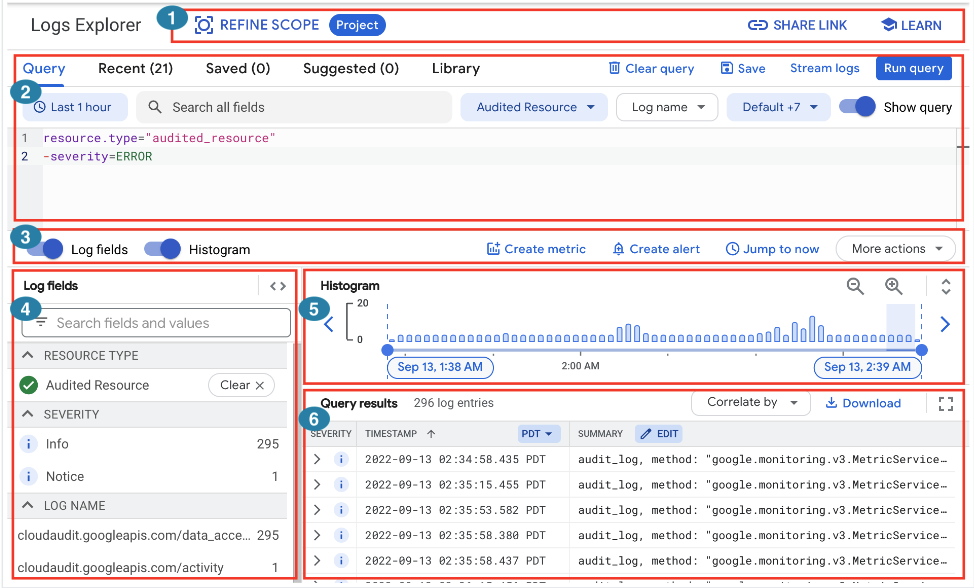

# Why Cloud Logging

1. k8s
2. streaming, micro-batch service.

* GCP 提供了 LogExplorer - https://console.cloud.google.com/logs/
* [介紹 - 還可以用 dashboard](https://www.microfusion.cloud/2021/03/05/gcp-log-viewer-20201013/)

# Logs Explorer interface

</img>

[official doc](https://cloud.google.com/logging/docs/view/logs-explorer-interface)

[logging query language](https://cloud.google.com/logging/docs/view/building-queries#library-queries)

1. which project
2. construct your logging query
3. show log fields, show histogram
4. the log field (which resource, which instance, ...)