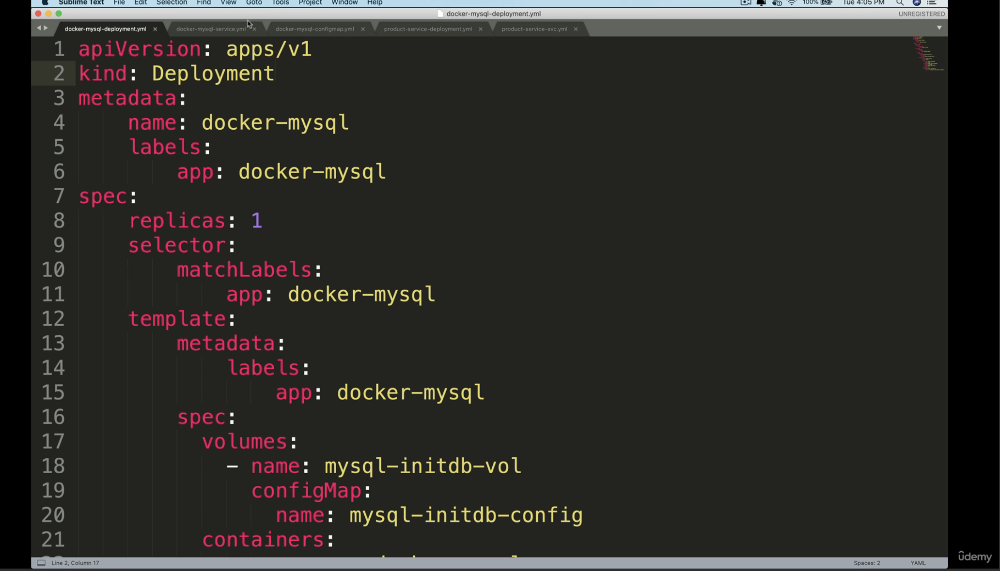

# Before Helm

</img>

## Consistency

</img>

need to figure out
* app version
* port stuff
* label, and name
* a lot of micro-service
* **and all the files are static** - which means it will be hard to maintain.

## Revision History

</img>

</img>

# Packaging Manger

</img>

</img>

</img>

</img>

</img>

# Why Helm

</img>

* we don't need to know about specific port of mongodb / mysql, we could just make it work.

</img>

</img>

</img>

</img>

</img>

# Chart & Repo

</img>

https://bitnami.com/stacks/helm