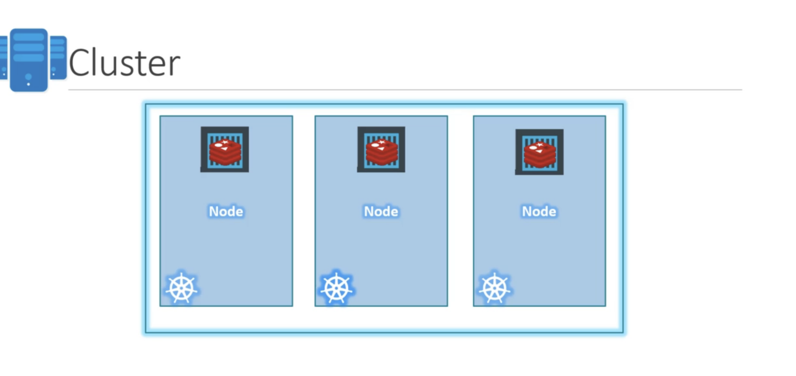
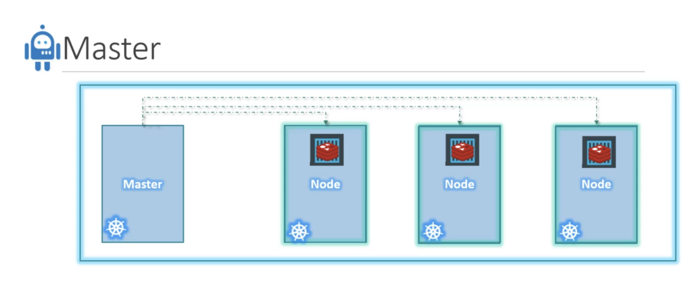
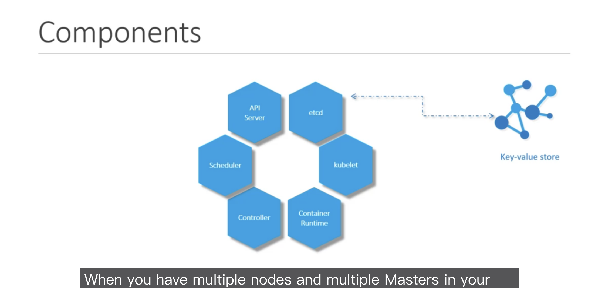
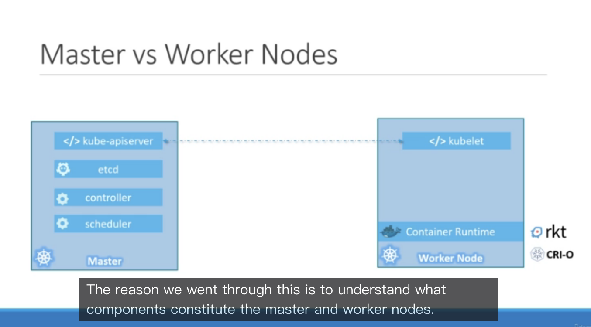

# Course

https://www.udemy.com/course/learn-kubernetes/learn/lecture/9723226#overview

* Node

</img>

* Cluster

</img>

</img>

</img>

* API Server - coomunicate with user(developer)
* etcd - store of metadata using key-value store
* scheduler - distributed work across multiple nodes
* controller - when container goes down, controller will create new container
* container runtime - how to run the container(we use docker for most case)
* kubelet - agent for each node - responsible for making sure that the containers are running as expected.

* kubectl - kube command line tool