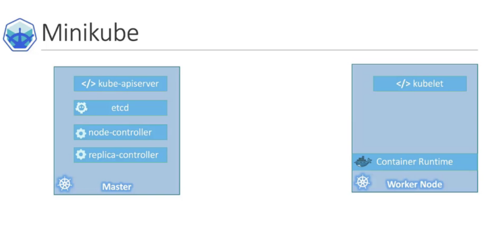
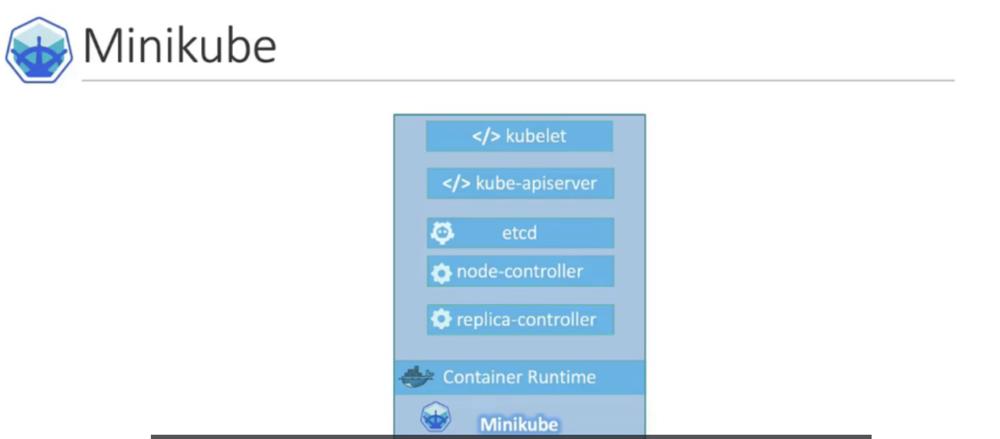

# Course

https://www.udemy.com/course/learn-kubernetes/learn/lecture/9723226#overview


# minikube

https://kubernetes.io/zh-cn/docs/tasks/tools/

all on one locally

[install at here](https://minikube.sigs.k8s.io/docs/start/)

* install minikube
* minikube start
  * will start some service


</img>

</img>

# Getting Start

1. check your docker goes well - `docker run hello-world` (you should have docker daemon)
2. check minikube status - `minikube status` (we caould also add `--alsologtostderr`)
3. check the container is running - `docker container ls`
4. check we the cluster is connected - `kubectl cluster-info`
5. creating a deployment - `kubectl create deployment hello-minikube --image=kicbase/echo-server:1.0` --> we called it service
6. expose the deployment - `kubectl expose deployment hello-minikube --type=NodePort --port=8080`
7. forwarding to local machine - `kubectl port-forward service/hello-minikube 7080:8080`
8. `http://localhost:7080/`
9. manage the cluster
   1.  `minikube pause`
   2.  `minikube unpause`
   3.  `minikube stop`
   4.  `minikube config set memory 9001` (require a restart)
   5.  `minikube addon list`
   6.  `minikube delete --all`
10. `kubectl get deployments` - get all the deployments
11. `kubectl get pods` - get pods(n+ container)
12. `minikube service` - 

# create a local cluster

```
(base) joetsai@host:~$ minikube start
😄  minikube v1.29.0 on Darwin 12.6.1 (arm64)
✨  Automatically selected the docker driver
📌  Using Docker Desktop driver with root privileges
👍  Starting control plane node minikube in cluster minikube
🚜  Pulling base image ...
🔥  Creating docker container (CPUs=2, Memory=4000MB) ...
🐳  Preparing Kubernetes v1.26.1 on Docker 20.10.23 ...
    ▪ Generating certificates and keys ...
    ▪ Booting up control plane ...
    ▪ Configuring RBAC rules ...
🔗  Configuring bridge CNI (Container Networking Interface) ...
    ▪ Using image gcr.io/k8s-minikube/storage-provisioner:v5
🔎  Verifying Kubernetes components...
🌟  Enabled addons: storage-provisioner, default-storageclass

❗  /Users/joetsai/opt/google-cloud-sdk/bin/kubectl is version 1.23.14-dispatcher-dirty, which may have incompatibilities with Kubernetes 1.26.1.
    ▪ Want kubectl v1.26.1? Try 'minikube kubectl -- get pods -A'
🏄  Done! kubectl is now configured to use "minikube" cluster and "default" namespace by default
```

```
(base) joetsai@localhost:~$ minikube status
minikube
type: Control Plane
host: Running
kubelet: Running
apiserver: Running
kubeconfig: Configured
```

```
 (base) joetsai@localhost:~$ docker container ls
CONTAINER ID   IMAGE                                 COMMAND                  CREATED              STATUS              PORTS                                                                                                                                  NAMES
8d634d611779   gcr.io/k8s-minikube/kicbase:v0.0.37   "/usr/local/bin/entr…"   About a minute ago   Up About a minute   127.0.0.1:59778->22/tcp, 127.0.0.1:59779->2376/tcp, 127.0.0.1:59781->5000/tcp, 127.0.0.1:59782->8443/tcp, 127.0.0.1:59780->32443/tcp   minikube
```
# kubectl

* localhost cluster, cross-network cluster, remote cluster
* `kubectl cluster-info` : check which cluster is connected