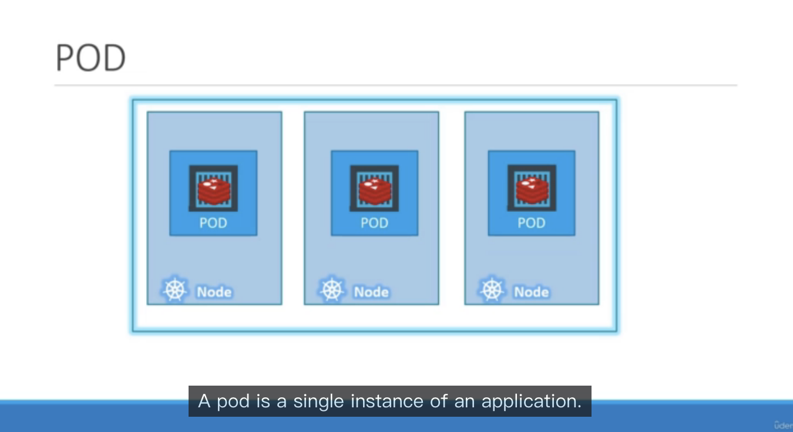
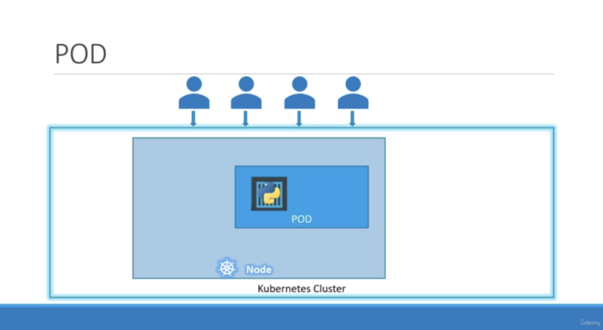
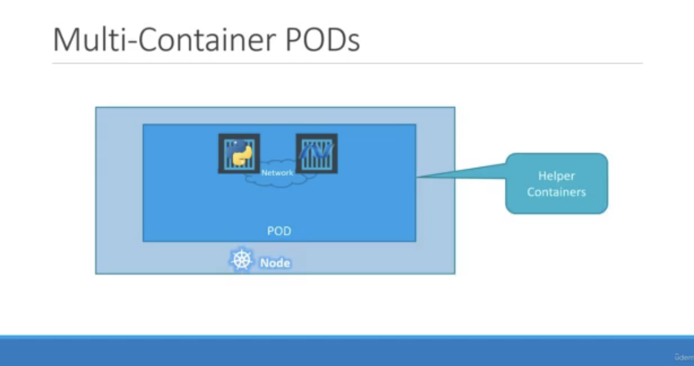
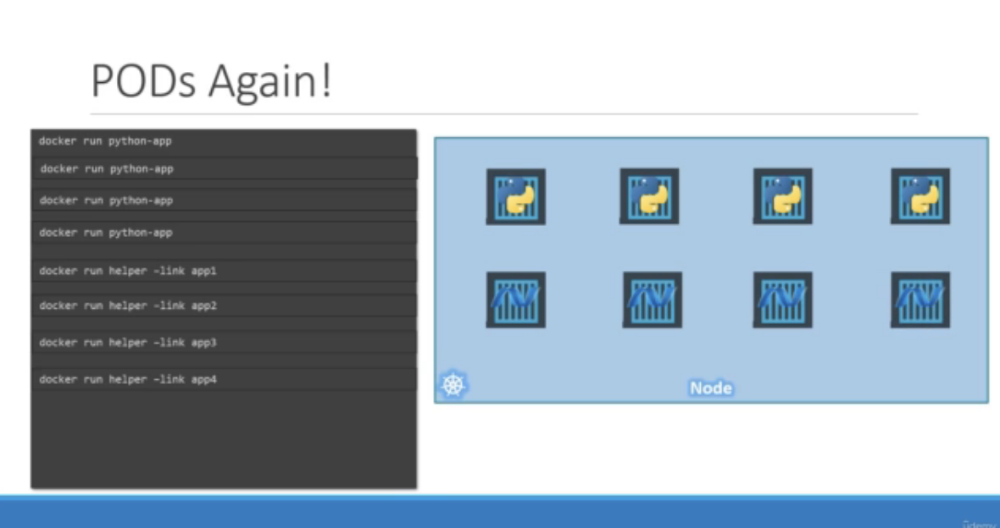
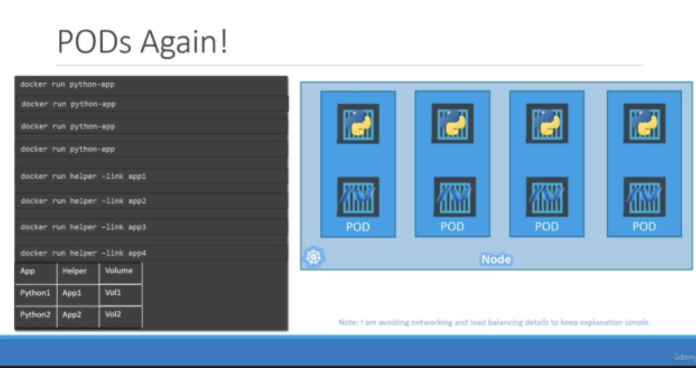
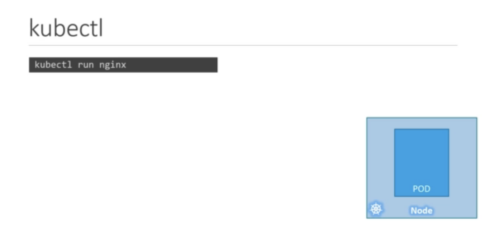
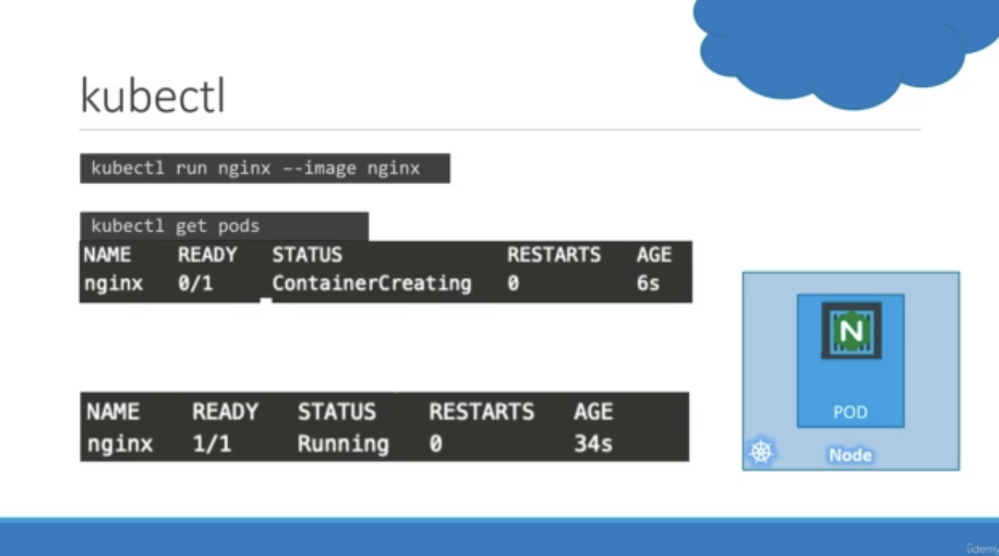

# Course

https://www.udemy.com/course/learn-kubernetes/learn/lecture/9723226#overview

# Pod - Single Container in the Pod

</img>

* Pod -  single instance of an applications
* smallest object you can create in kubernates
* pod in kubernates is 1 vs 1 relatation, we don't need to add more pods to scale, we can set up the auto-scaling or replica things.

</img>

# Pod - Multiple Container in the Pod

* there might be helper container to process the data, shared network.

</img>

</img>

</img>

# Demo

</img>

</img>

* `nginx` - by default, download from dockerhub
* `kubectl run nginx --image nginx` : download nginx from dockerhub and run it by kubenetes
* `kubectl get pods` : to know the alive pods
* `kubectl describe pods` - detail information about pods
  * we start with single cluster as minikube
  * single container, and the image id
  * events part - what happend including pulling images and creating containers, and start containers
* `get pods -o wide` - more inforamtion, but noo too detail.