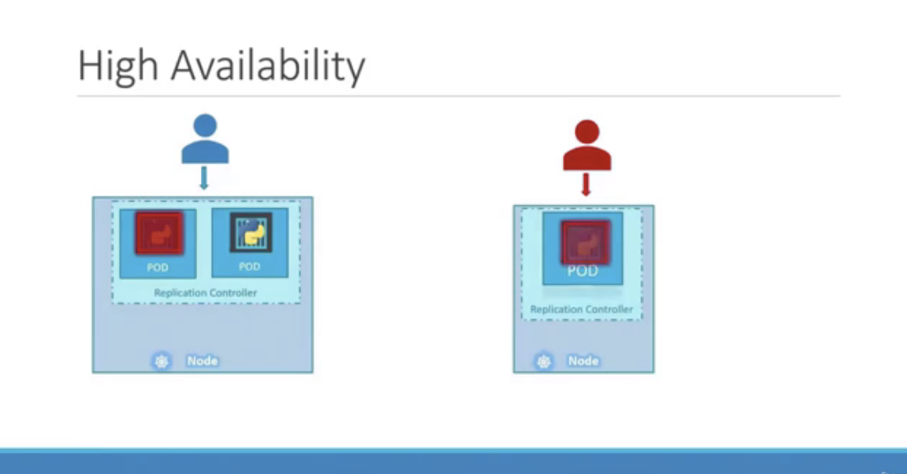
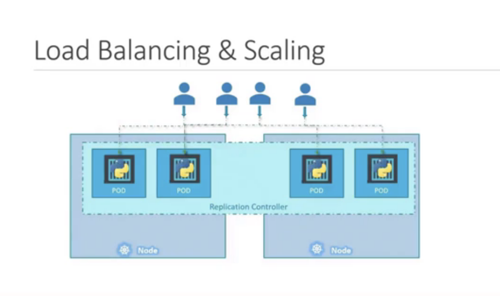
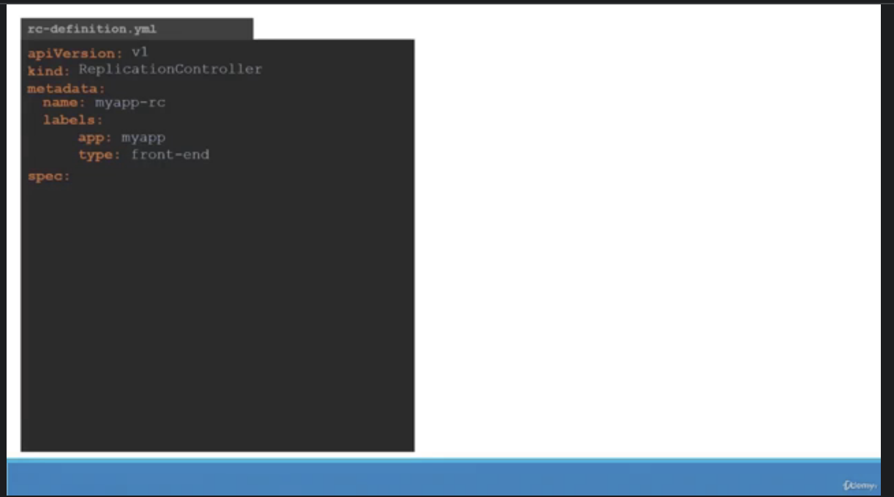
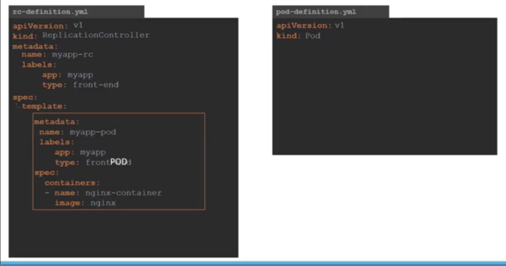
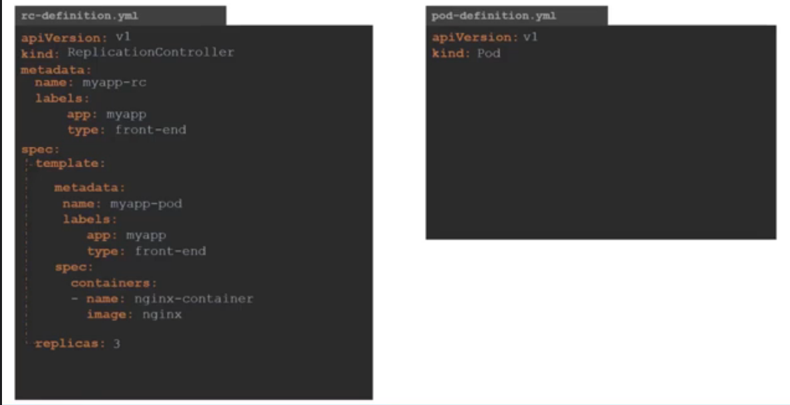
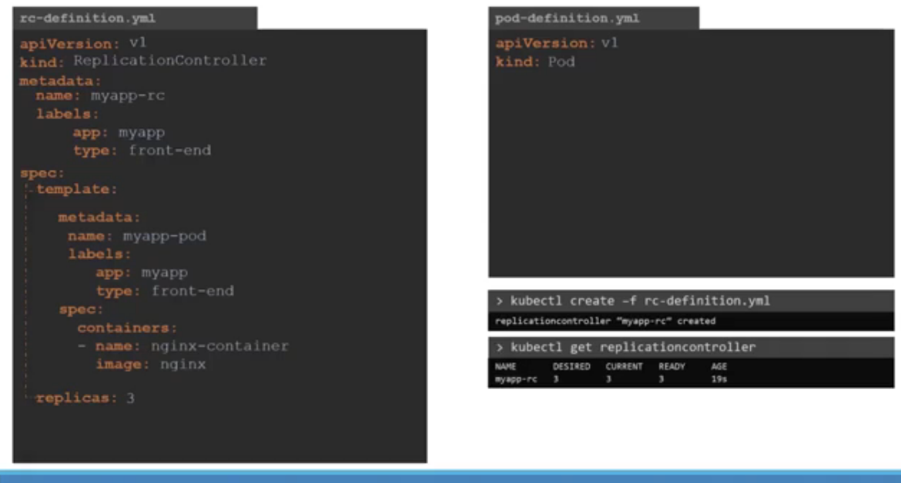
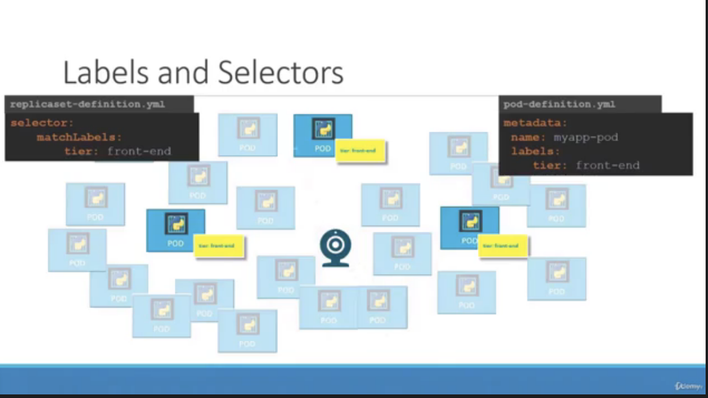
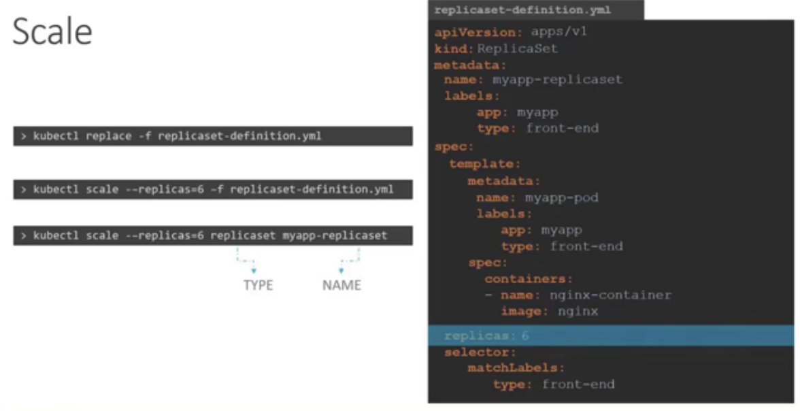

# Scaling By Replica (Replication Controller)

* High Availability

</img>

* Load Balancing and Scaling

</img>

# Replication Controller vs Replica Set

* Replication Controller is a older term, Replica set is newer

# Replication Controller

</img>

</img>

</img>

</img>

# Replica Set

selector is the major difference between replication controller and replica set

</img>

* replica set is acutally monitoring the pods and make sure there are `n` `active pods` we specified in yaml file.
* however, there will be a lot of pods in the cluster.
* so we need Label (for pods) and matchLabel (for replicaset) to let replicaset knowing which pods should be monitoring
* same idea in any other place in Kubernates

## Scale

how we scale 3 replicas to 6?

1. replcias `3` --> `6`
2. `kubectl scale --replcias=6 -f your_replicaset.yaml` - select files (wont chamge the file)
3. `kubectl scale --replcias=6 -f replicaset myapp-replicaset` - select application in replicaset (wont change the file)
4. auto-scaling is also avaliable

</img>

# NOTE

1. `kubectl create` --> 直譯式，如果 pods 存在， raise Error
2. `kubectl apply` --> 宣告式，自動偵測 pods 存不存在，存在會做更新
3. `kubectl describe replicaset your_replicaset_name`

# 狀況題

1. Creating the same pods of label but outside the replicaset.

* **replicaset will shut down the creating pods** - because the replicaset is monitoring the selected label

2. scale up
   1. best practice - change yaml and apply
   2. kubectl scale replicaset name 100

# 028

* `kubectl describe pod myapp-replicaset-6rljq` - could also check the lifecycle (pulling, failing / creating / xxx)
* `kubectl explain replicaset` - explain means `help` - the help command about replicaset
* `kubectul get rs` - means the replicaset