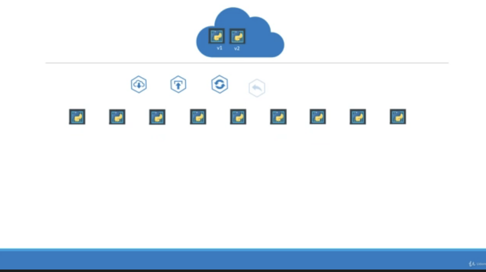
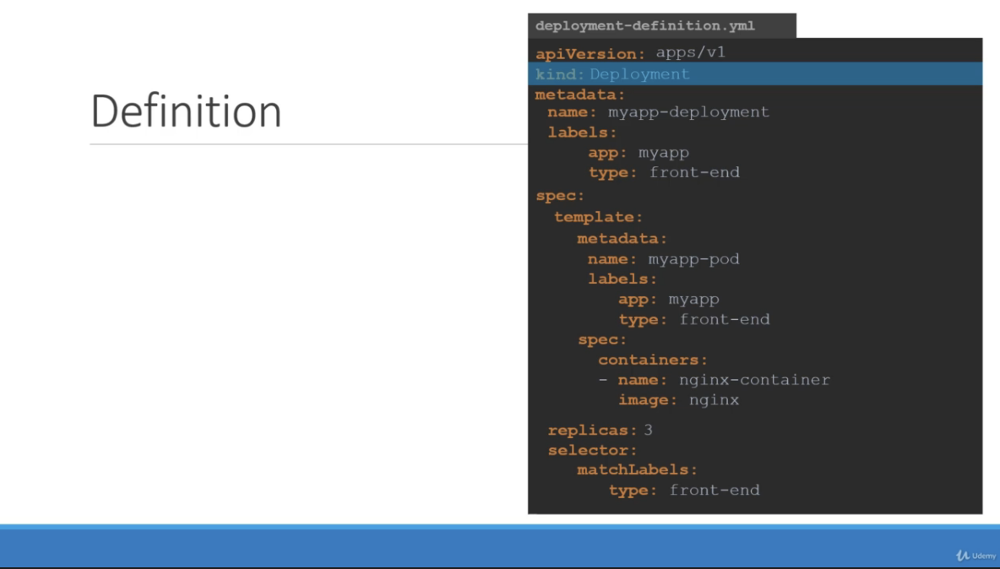

# Deployment

</img>

forget about pods and replicaset

when you developing - there might be rolling update. and failure restarted

1. pods contain the application of your developement (multiple container with shared network)
2. replica make sure the scaling
3. Deployment is a kubernates object to submit it all in once. (rolling update, undo changes, parse and resume changes)

</img>

</img>

</img>

# Commands

`kubectl get all` (get all kubernates objects)

# 030

1. `kubectl apply -f 030_deployment.yaml`
2. `kubectl get all`
3. `kubectl describe deployments myapp-deployment`


```bash
Name:                   myapp-deployment
Namespace:              default
CreationTimestamp:      Sat, 25 Mar 2023 15:18:48 +0800
Labels:                 app=nginx
                        type=frontend
Annotations:            deployment.kubernetes.io/revision: 1
Selector:               type=front-end
Replicas:               3 desired | 3 updated | 3 total | 3 available | 0 unavailable
StrategyType:           RollingUpdate
MinReadySeconds:        0
RollingUpdateStrategy:  25% max unavailable, 25% max surge
Pod Template:
  Labels:  app=myapp
           type=front-end
  Containers:
   nginx-container:
    Image:        nginx
    Port:         <none>
    Host Port:    <none>
    Environment:  <none>
    Mounts:       <none>
  Volumes:        <none>
Conditions:
  Type           Status  Reason
  ----           ------  ------
  Available      True    MinimumReplicasAvailable
  Progressing    True    NewReplicaSetAvailable
OldReplicaSets:  <none>
NewReplicaSet:   myapp-deployment-7b8f9fc866 (3/3 replicas created)
Events:
  Type    Reason             Age    From                   Message
  ----    ------             ----   ----                   -------
  Normal  ScalingReplicaSet  2m40s  deployment-controller  Scaled up replica set myapp-deployment-7b8f9fc866 to 3
```

# 032


1. trouble shooting 

`kubectl get all` --> `kubectl get deployment` --> `kubectl get replicaset (rs)` --> `kubectl get pods` --> `kubectl describe pod pod-id` (to check the image error then)

2. `kubectl create deployment --help` : get help information about deployment

3. `kubectl apply deployment --help` 
4. when updating

```
kubectl rollout status deployment/myapp-deployment
Waiting for deployment "myapp-deployment" rollout to finish: 1 out of 3 new replicas have been updated...
Waiting for deployment "myapp-deployment" rollout to finish: 1 out of 3 new replicas have been updated...
Waiting for deployment "myapp-deployment" rollout to finish: 1 out of 3 new replicas have been updated...
Waiting for deployment "myapp-deployment" rollout to finish: 2 out of 3 new replicas have been updated...
Waiting for deployment "myapp-deployment" rollout to finish: 2 out of 3 new replicas have been updated...
Waiting for deployment "myapp-deployment" rollout to finish: 2 out of 3 new replicas have been updated...
Waiting for deployment "myapp-deployment" rollout to finish: 1 old replicas are pending termination...
Waiting for deployment "myapp-deployment" rollout to finish: 1 old replicas are pending termination...
deployment "myapp-deployment" successfully rolled out
```