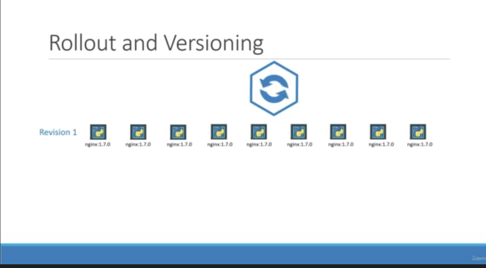
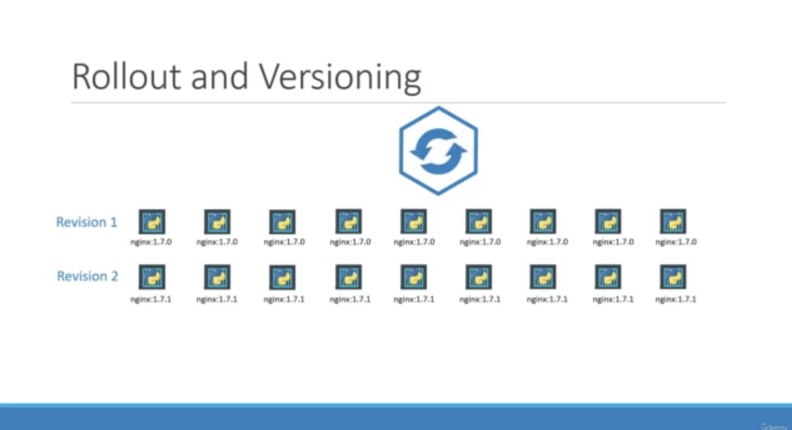
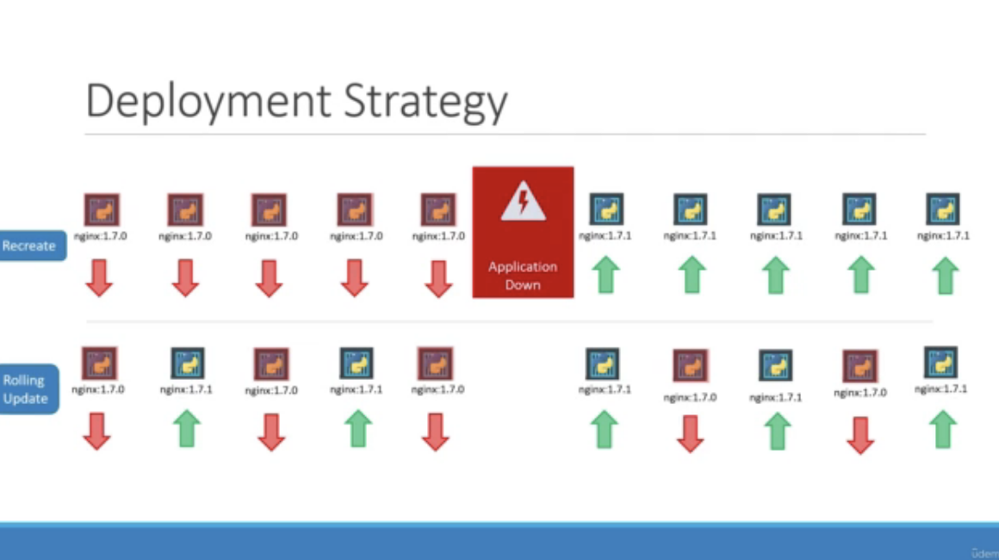
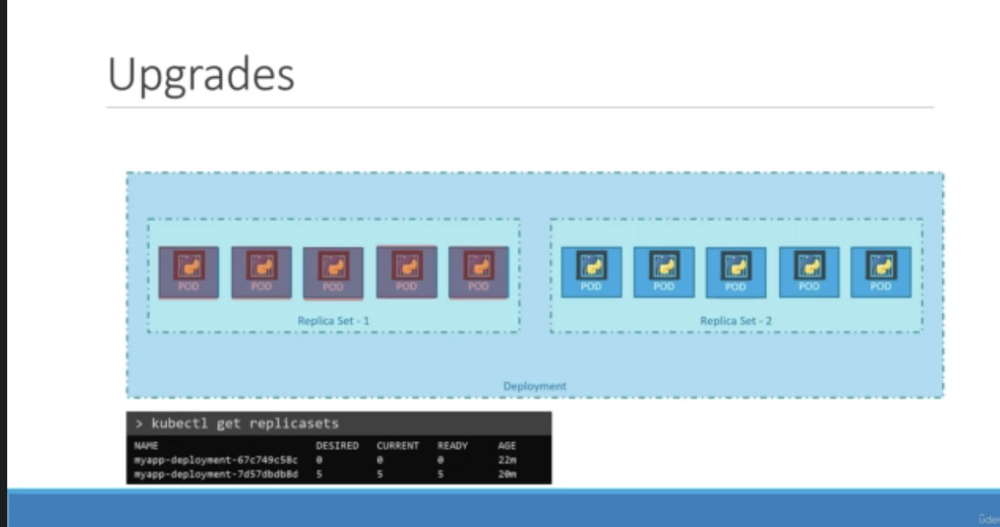
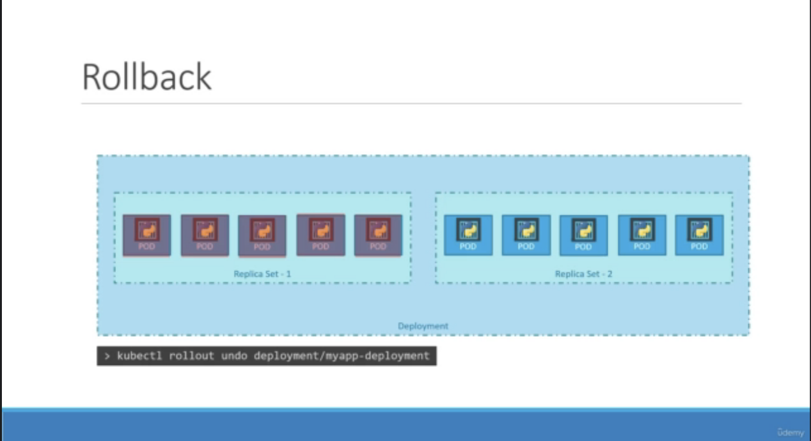

# Deployments - update and rollback

* when you firsy create a deployment - it triggers a `rollout`.
* `rollout` create a new deployment revision

</img>

</img>

* help us to track deployment and rollback

* `kubelctl rollout status deployment/deployment_name`
* `kubelctl rollout history deployment/deployment_name`

</img>

* rolling update is the default strategy
* recreate --> cause service down time.

# When Upgrades & Rollback

</img>

</img>

`kubectl rollout undo deployment/myapp-deployment`

# The Command summary

1. create - `kubectl create` or `kubectl apply` -f deployment.yaml
2. get - kubectl get deployments
3. update - kubectl apply -f deployment.yml
4. Ststus - kubectl rollout status deployment/deployment_name
5. Ststus - kubectl history status deployment/deployment_name
6. rollback - kubectl rollout undo deployment/deployment_name

