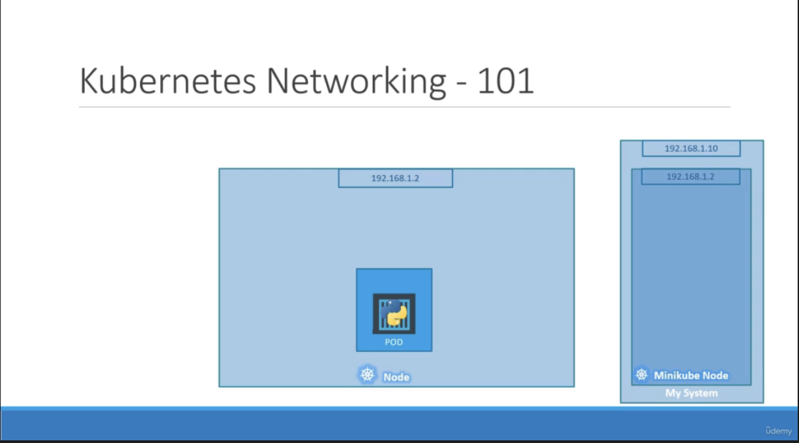
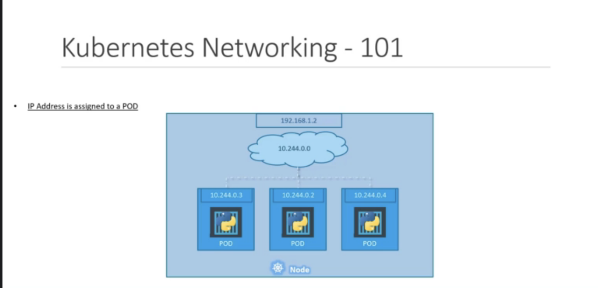
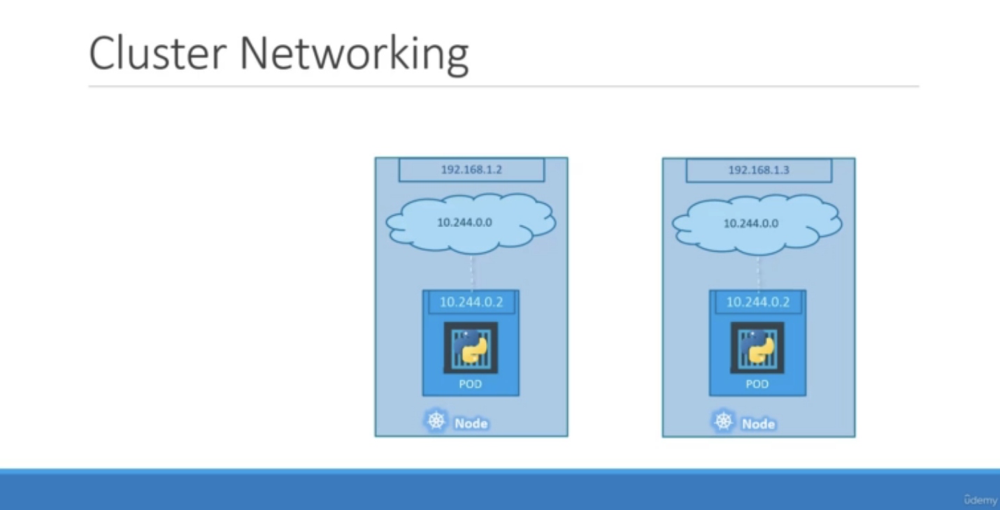
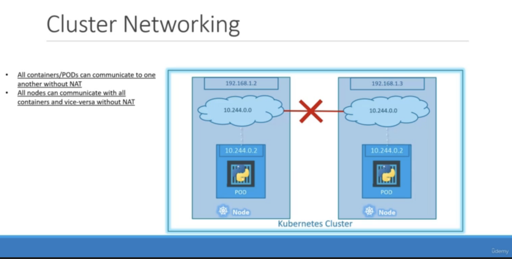
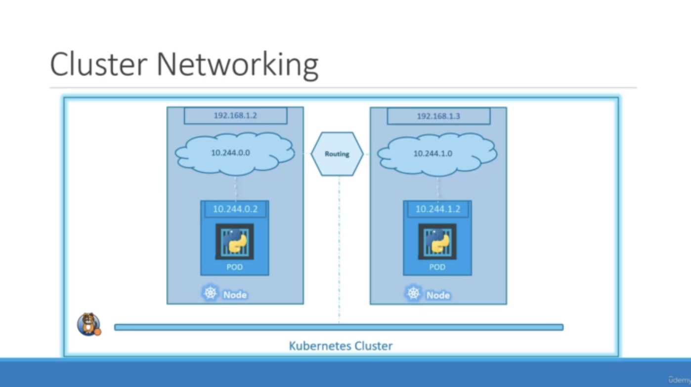

# Minicibe version and Single Node Kubernetes Cluster

</img>

</img>

# Multiple Node

</img>

</img>

Use third-party tool to setup the network.

</img>

* Pod 之內，Container 是共享在同個網路環境
* Pod 之間，需要 third-party solution 來建立網路環境，讓 Pod 之間可以溝通