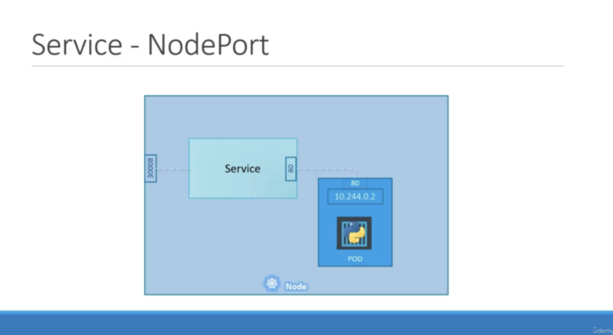

# Service - NodePort

</img>

* Service helps us connect applications together with other applications or users.

</img>

* Such as Fronted, Backend, DataSource(MLTeam, DataTeam)

</img>

# Pod as a Service

</img>

</img>

</img>

* how can we access the port at `10.244.0.2` ?
  * ssh the host(192.168.1.2), curl the 10.244.0.2
  * Service - NodePort(kind of port forwarding)

# Type of Services (3種 service)

</img>

# NodePort

</img>

</img>

It's a `Service` point of view :

1. TargetPort - the pod-port inside the node
2. Port - the Service port
3. NodePort - the node port expose to the user, ranged from 30000 - 32767

</img>

* default value of port - same as targetport
* default value of nodePort - random assigned from 30000 to 32767
* selector - to select Pod to expose port

`kubectl create -f service_definition.yaml`

`kubectl get services`

</img>

* if a NodePort match multiple Pod, the request from user will forward to random select 1 pods

* Multiple Node also work! the only things to do is creating a service.

</img>

