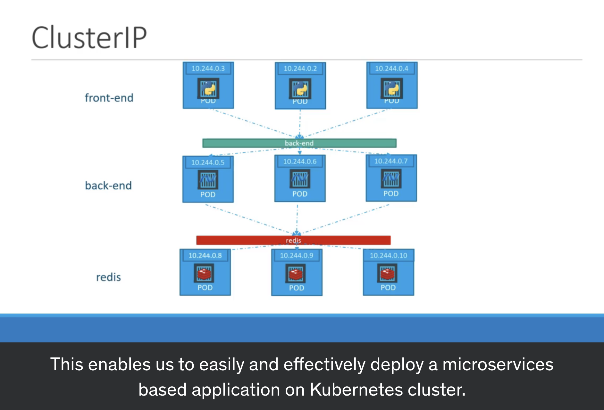

# ClusterIP

grouping the pods into a single `service name`, since pod will be re-created, re-launched, died. IP will be not reliable.

which could help you deploy a micro-service to anywhere.

</img>