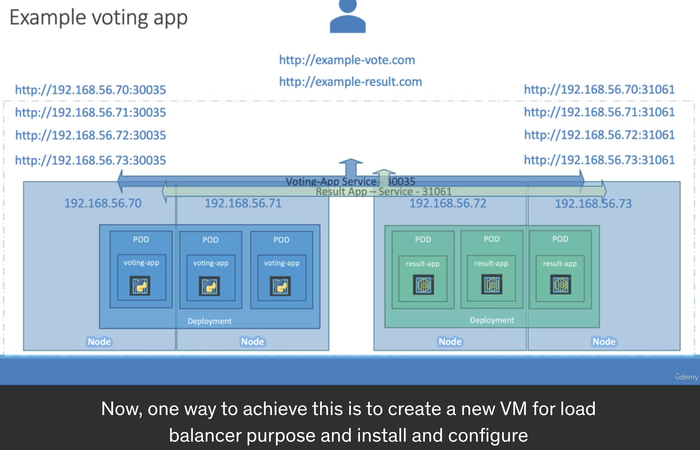
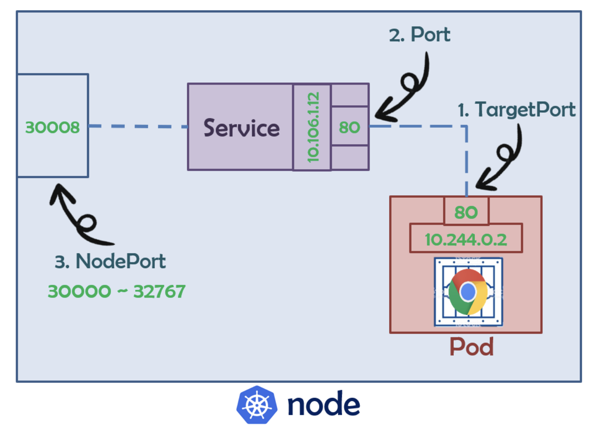
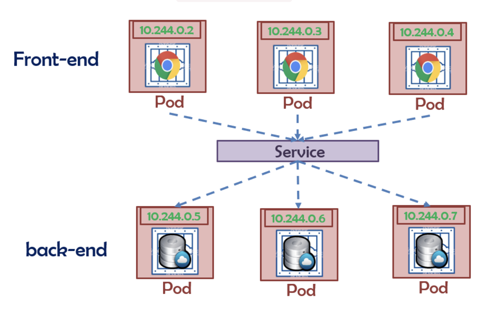

# Node Port

* 將 Pod expose 給外部使用者!

</img>

* 此時 service 可以想像成 cluster 中的 virtual server，擁有自己的IP，稱為 ClusterIP

# CLusterIP

* k8s default service type
* 保護資料不被外部存取

</img>

# LoadBlancer

</img>

* 將服務曝光到 internet 的標準方式，所有通往指定 port 的流量都會被 forward 到對應的服務 (HTTP/TCP/UDP/Websocket/gRPC)
* 缺點 - 每個 LoadBalancer 都有自己的 IP，每個用到的 LoadBalancer 都要付費，因此會和 Ingress 一起使用

[ref - 【從題目中學習k8s】-【Day5】K8s中的resource object(二) - Service
](https://ithelp.ithome.com.tw/articles/10235548)
