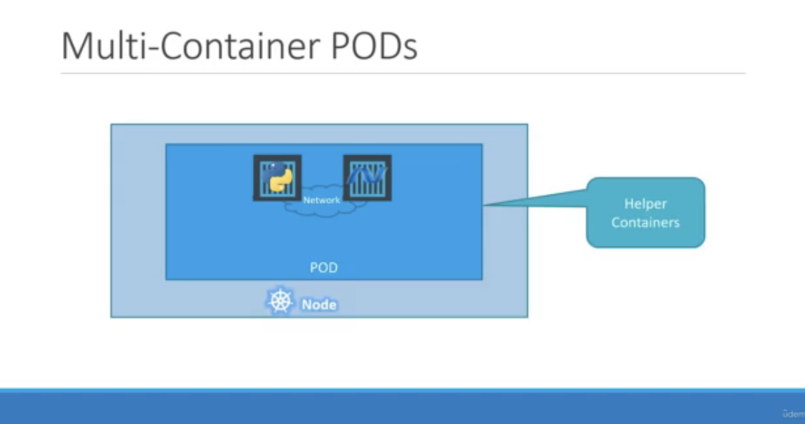

# Review Cluster, Pod, Deployment, Container

* 一個 Cluster 中有多個 Node (多台機器)
* 一台機器中可以有多個 Pod (k8s 中的工作單元)
* 一個 Pod 可以有多個 container 

</img>

</img>

</img>

* Pod 可以透過 k8s 的設計產生 replica (一模一樣的工作單元)，姐此達到水平擴展

* deployment 可以組合多個不同功能的 pod ， 組合成一個應用服務(application)

# Service 

Why service?

1. pod - 多個 container 在同個網路空間
2. 不同 pod?
3. deployment 對外提供服務?
4. pod 死了，重啟新的 pod，如何持續對外提供服務?

Service 是 k8s 中的網路元件

</img>

1. 讓 deployment 提供對外網路的入口
2. pod 因為任何原因死掉，自動讓新啟動的 pod 可以銜接到同樣的網路接口
3. 三種不同類型的 service ， 用於不同場景

# Node Port

* 將 Pod expose 給外部使用者!

</img>

* 此時 service 可以想像成 cluster 中的 virtual server，擁有自己的IP，稱為 ClusterIP

# ClusterIP

* k8s default service type
* 保護資料不被外部存取

</img>

# LoadBlancer

</img>

* 將服務曝光到 internet 的標準方式，所有通往指定 port 的流量都會被 forward 到對應的服務 (HTTP/TCP/UDP/Websocket/gRPC)
* 缺點 - 每個 LoadBalancer 都有自己的 IP，每個用到的 LoadBalancer 都要付費，因此會和 Ingress 一起使用

[ref - 【從題目中學習k8s】-【Day5】K8s中的resource object(二) - Service
](https://ithelp.ithome.com.tw/articles/10235548)
