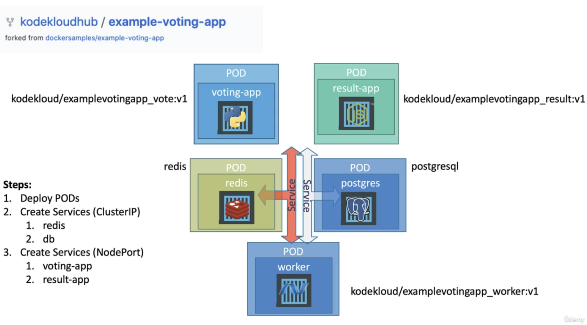

# Micro-Service Applications

</img>

</img>

# Check Workers & Pods on Kubernetes

</img>

service name 

1. redis (align in the code), do not use port, port might changed
2. db (align in the code)
3. nodeport (should be loading balancer when you guys doing in the company)

</img>

</img>

# Repo

`git clone https://github.com/mmumshad/example-voting-app-kubernetes-v2.git`

[check here](https://www.udemy.com/course/learn-kubernetes/learn/lecture/9752888#questions/12458624)

create all the deployment and services by `kubectl create -f .`

`kubectl get service`

`minikube service voting-service  --url`
` minikube service result-service --url`