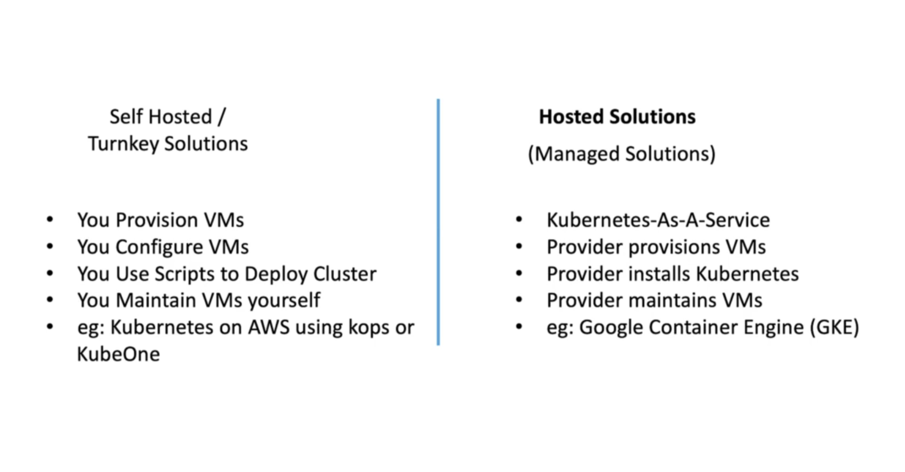
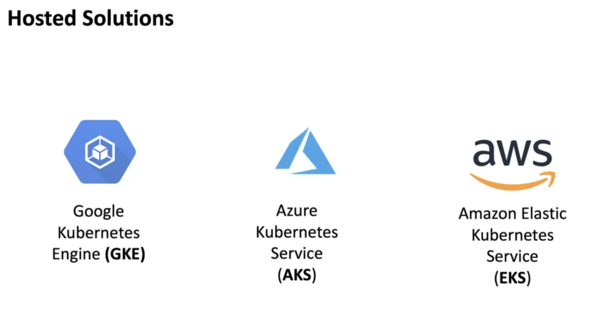
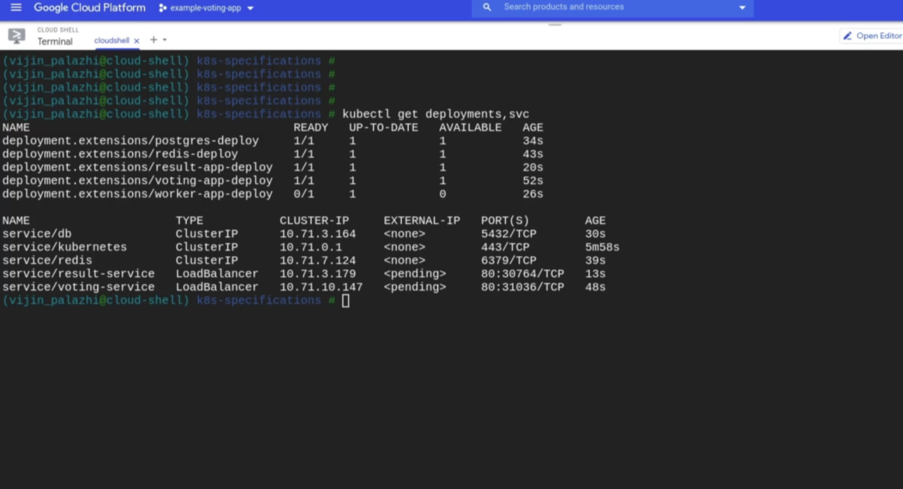

# Self Hosted & Managed Solutions

</img>

</img>

# GCP

you could create kubernetes cluster by UI / commend line. - it will take **5~10 mins**

you could also connect with gcloud shell.

## Steps

1. create cluster by UI/Command

2. connect the cluster

3. clone repo

4. deploy them by `kubectl apply -f .`

</img>

* need to expose the IP to public network

## AWS / Azure

go back when we needed.