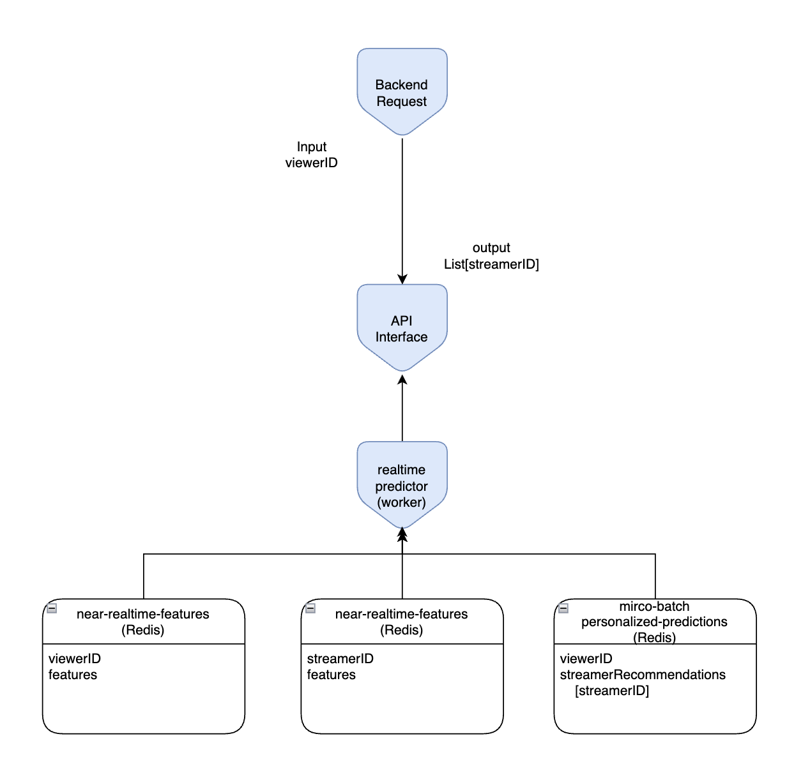

# service design

</img>
# Ref
[here](https://sumanta9090.medium.com/deploying-a-fastapi-application-on-kubernetes-a-step-by-step-guide-for-production-d74faac4ca36)

# step 0 - hello world code in fastapi

* create hello world example in `app`


# step 1 Build docker image from Dockerfile

* create dockerfile

`docker build -t yltsai0609/fastapi:0.1 .`

`docker run -p 8080:80 yltsai0609/fastapi` - make sure you do create a executable container 

`http://localhost:8080/docs`

## step 1-1 push images to dockerhub

https://ithelp.ithome.com.tw/articles/10191139

final verify command : `docker run --rm -p 8080:80 yltsai0609/fastapi`


# step 2 - set up a kubebetes cluster

`minikube status` - make sure you do get a cluster

# step 3 - create a deployment

create a file `deployment.yaml`

`kubectl apply -f deployment.yaml`

could use `kubectl get deployment` and `kubectl describe deployment myapp` to check the status of your deployment

# step 4 - create a service (here we create a LoadBalancer)

could use `kubectl get service` and `kubectl describe deployment myapp` to check the status of your service.

# step 5 - access the fastapi applications

`minikube service myapp-service --url`

```shell
http://127.0.0.1:63799
❗  Because you are using a Docker driver on darwin, the terminal needs to be open to run it.
```

* 成功!

NOTE:

若是跟後端介接，可能考慮的 service 是 ClusterIP (對內連線)

如果是跨專案，可能還是需要透過 Loading Balancer