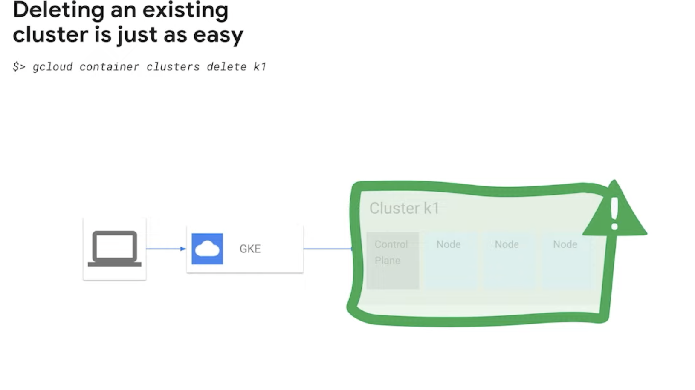
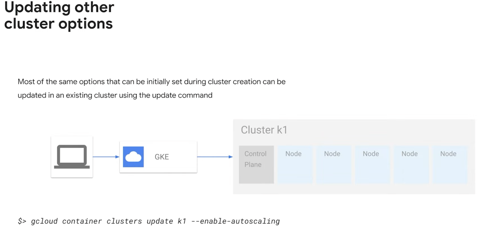
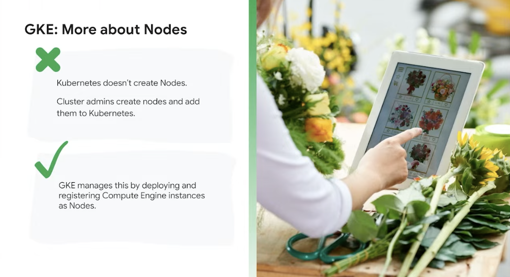
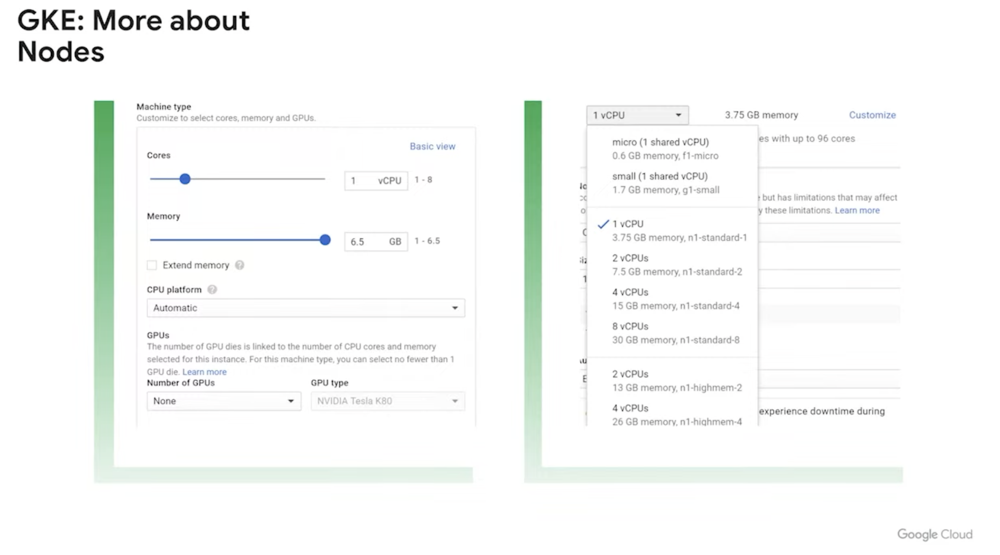
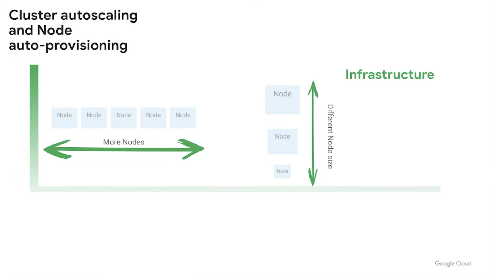

# Ref

https://cloudonair.withgoogle.com/events/taiwan-cloud-onboard-architecturemodernization-2021

# GKE Getting start

[quick start](https://cloud.google.com/kubernetes-engine/docs/quickstart)

* 可以手動開也可以 command line 開
* NodePool - 不同的 VM 屬性(例如需要 GPU)

## CRUD

Create

</img>

`gcloud container clusters create --zone us-central1 -a k1`

Delete

</img>

Resize

Update

</img>

## GKE - Nodes

</img>

以秒計費 --> 有可能蠻貴的
Node - Compute Enginer VM(e2 medium)

</img>

</img>

水平擴展 / 垂直擴展? - 可以自動配置

# Note

1. Basic property

Zonal - Control Plane, Data Plane 都在同個地方(機器掛了就死了)

Regional - Control Plane, Data Plane 在不同地方(機器掛了還可以活著)

2. Node pools

   
3. Security