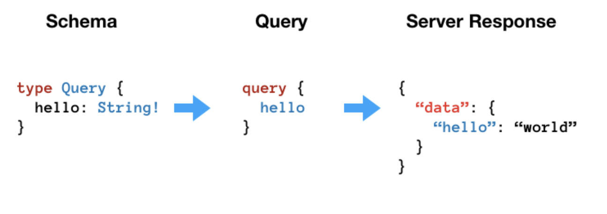

# What is GraphQL?

[GraphQL 入門： 簡介 X 範例 X 優缺點](https://ithelp.ithome.com.tw/articles/10200678)

1. GraphQL 是一種專門為 API 設計的資料查詢(修改)
2. Facebook 從 2012 年開始使用 - 為了因應跨裝置及開發 News Feed 功能而開發
3. 2015 年公開釋出
4. 概念類似 SQL (SELECT, CREATE, UPDATE)
5. 主要使用於應用服務之間的溝通(尤其是前後端)，可以想像是一種新型態的 RESTful API
6. 近幾年聲勢看漲， Github, Shopify, Coursera, Twitter 都開始去用，因為
   1. 行動裝置普及
      1. 資料傳遞速度嚴重影響效能
      2. 不同平台的資料格式可能不同(需要更彈性的query方式)
   2. Business Logic 越來越複雜
      1. schema 設計複雜
      2. 前後端溝通難度增加
      3. Legacy API 難以處理
   3. Micro service 崛起
      1. 需要一個統一的介面

GraphQL 強化了前端的控制權

query 寫在前端，並配合適當的資安措施

</img>

</img>

不同 / 相同 type 的資料可以串接再一起，使得 GraphQL 只要一比 query 就可以拿全資料且資料格式非常有彈性

不在需要多筆 request 在做 JOIN

# 優點

1. 精準資料取得
   * 宣告式資料索取
   * 資料只拿剛好且彈性十足
   * 透過資料之間的關係連接(就像一幅 Graph)，大幅度減少來回 request 的次數
2. 程式碼即文檔
   * 前後端溝通成本減少
   * 以資料需求驅動的設計方式
   * 建立文檔的時間幾乎為0
3. 前端控制權提升
   * 過往因應不同平台或裝置而需要一套新的 API 系統
   * GraphQL API 只需要一套，其他的交給前端自行決定資料索取的格式 & 方式
   * GraphQL query 與回傳資料格式幾乎相同，大大減少前端錯估資料樣貌的可能性
   * 前端不再被日益複雜的架構設計綁住，開發速度大增
4. 高自由服的實作方式
   * 語言無關 / 資料庫無關
   * 不同的 micro service / GraphQL shcema 可被串接在一起
5. 強型別(Strongly Typed)
   * 型別錯就直接被擋下
   * 支援 5 種基礎型別(Scalar Types)
   * 能自定義型別(URL, TIMPSTAMP, DATE< PHONE_NUMBER, ...)

# 缺點

1. 過於自由、規範少
   * 沒有一定實作規範、可能因為前後端對架構的疏忽或不了解導致設計出過於複雜的 Schema
   * 沒有一個成熟的 Best Practice 時，容易出現 Anti Pattern
   * 不懂 GraphQL 優勢，而設計出一套 RESTFul GraphQL
2. 學習成本
   * GraphQL 不是一項很難的技術，但若要應用到整個公司或是架構上，仍需要時間推廣以及謹慎的設計，討論
   * 很容易一不小心陷入 RESTful API 的設計思維，埋下更多技術債
   * 很多技術如效能處理、錯誤處理不吐 4XX，安全性等等都要額外的學習
3. 技術仍在蓬勃發展
   * 可能使用之後，技術上發生 breaking change 
   * 主要使用 POST + Json body，所已原生不支援 multiple part
4. Server Side Caching 實作困難
   * RESTful API 的 endpoint 固定且資料需求單純，然而 GraphQL 難以保證每次 request 的模樣，因此較難識做 Caching 


# Example

[JustWatch](https://www.justwatch.com/tw/%E7%AF%80%E7%9B%AE)

GraphQL in endpoint: filter by `graphql` in Networking


```
operationName: "GetPopularTitles"
query: "query GetPopularTitles($country: Country!, $popularTitlesFilter: TitleFilter, $watchNowFilter: WatchNowOfferFilter!, $popularAfterCursor: String, $popularTitlesSortBy: PopularTitlesSorting! = POPULAR, $first: Int! = 40, $language: Language!, $platform: Platform! = WEB, $sortRandomSeed: Int! = 0, $profile: PosterProfile, $backdropProfile: BackdropProfile, $format: ImageFormat) {\n  popularTitles(\n    country: $country\n    filter: $popularTitlesFilter\n    after: $popularAfterCursor\n    sortBy: $popularTitlesSortBy\n    first: $first\n    sortRandomSeed: $sortRandomSeed\n  ) {\n    totalCount\n    pageInfo {\n      startCursor\n      endCursor\n      hasPreviousPage\n      hasNextPage\n      __typename\n    }\n    edges {\n      ...PopularTitleGraphql\n      __typename\n    }\n    __typename\n  }\n}\n\nfragment PopularTitleGraphql on PopularTitlesEdge {\n  cursor\n  node {\n    id\n    objectId\n    objectType\n    content(country: $country, language: $language) {\n      title\n      fullPath\n      scoring {\n        imdbScore\n        __typename\n      }\n      posterUrl(profile: $profile, format: $format)\n      ... on ShowContent {\n        backdrops(profile: $backdropProfile, format: $format) {\n          backdropUrl\n          __typename\n        }\n        __typename\n      }\n      __typename\n    }\n    likelistEntry {\n      createdAt\n      __typename\n    }\n    dislikelistEntry {\n      createdAt\n      __typename\n    }\n    watchlistEntry {\n      createdAt\n      __typename\n    }\n    watchNowOffer(country: $country, platform: $platform, filter: $watchNowFilter) {\n      id\n      standardWebURL\n      package {\n        packageId\n        clearName\n        __typename\n      }\n      retailPrice(language: $language)\n      retailPriceValue\n      lastChangeRetailPriceValue\n      currency\n      presentationType\n      monetizationType\n      __typename\n    }\n    ... on Movie {\n      seenlistEntry {\n        createdAt\n        __typename\n      }\n      __typename\n    }\n    ... on Show {\n      seenState(country: $country) {\n        seenEpisodeCount\n        progress\n        __typename\n      }\n      __typename\n    }\n    __typename\n  }\n  __typename\n}\n"
variables: {popularTitlesSortBy: "POPULAR", first: 40, platform: "WEB", sortRandomSeed: 0, popularAfterCursor: "",…}
country: "TW"
first: 40
language: "zh"
platform: "WEB"
popularAfterCursor: ""
popularTitlesFilter: {ageCertifications: [], excludeGenres: [], excludeProductionCountries: [], genres: [], objectTypes: [],…}
popularTitlesSortBy: "POPULAR"
sortRandomSeed: 0
watchNowFilter: {packages: [], monetizationTypes: []}
```

python request

```python
search_gql_template = """query GetPopularTitles($country: Country!, $popularTitlesFilter: TitleFilter, $watchNowFilter: WatchNowOfferFilter!, $popularAfterCursor: String, $popularTitlesSortBy: PopularTitlesSorting! = POPULAR, $first: Int! = 40, $language: Language!, $platform: Platform! = WEB, $sortRandomSeed: Int! = 0, $profile: PosterProfile, $backdropProfile: BackdropProfile, $format: ImageFormat) {
  ...
"""


endpoint = 'https://apis.justwatch.com/graphql'
base = 'https://www.justwatch.com'

def build_graphql_variable(
    cursor : str = "MjAw",
    popularTitlesSortBy : str = "POPULAR",
    seed : int = 42
    ) -> dict:
    return {
      "popularTitlesSortBy": popularTitlesSortBy,
      "first": 100,
      "platform": "WEB",
      "sortRandomSeed": seed,
      "popularAfterCursor": cursor,
      "popularTitlesFilter": {
        "ageCertifications": [],
        "excludeGenres": [],
        "excludeProductionCountries": [],
        "genres": [],
        "objectTypes": ["SHOW"],
        "productionCountries": [],
#         "packages": ["nfx"],
#         "packages": [],
        "excludeIrrelevantTitles": False,
        "presentationTypes": [],
        "monetizationTypes": []
      },
      "watchNowFilter": {
#         "packages": [
#           "nfx"
#         ],
        "monetizationTypes": []
      },
      "language": "zh",
      "country": "TW"
    }


def build_search_payload(cursor : str, 
                         popularTitlesSortBy : str = "POPULAR",
                         seed = 42,
                        ) -> dict:
    return dict(
        operationName = "GetPopularTitles",
        variables = build_graphql_variable(
            cursor,
            popularTitlesSortBy,
            seed
        ),
        query = search_gql_template
    )

response = requests.post(
    endpoint,
    json=build_search_payload(
        cursor,
        popularTitlesSortBy,
        seed=seed
    ),
    timeout=timeout,
)

print(toc - tic)

crawled = response.json()
crawled
```