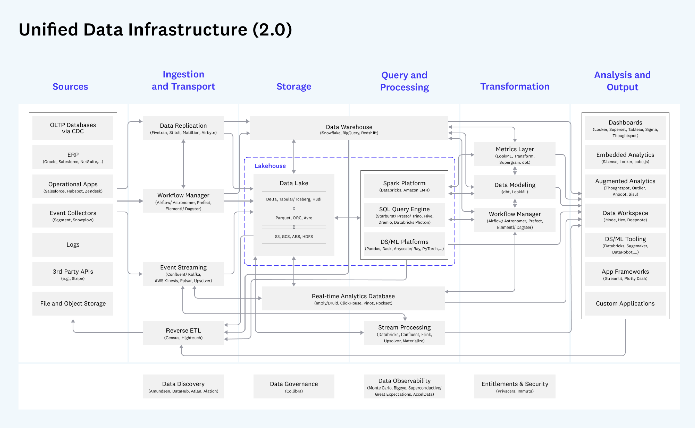
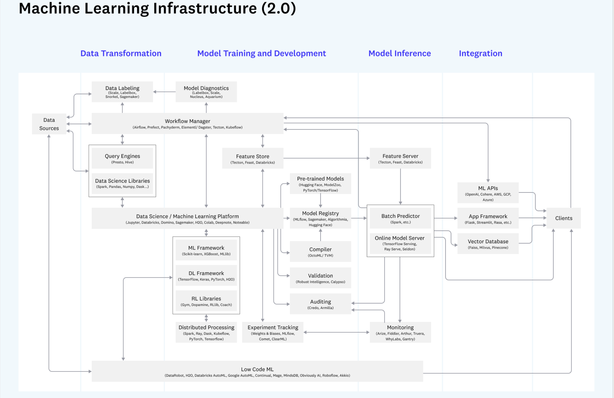

# Ref

[Emerging Architectures for Modern Data Infrastructure](https://future.com/emerging-architectures-modern-data-infrastructure/)

# Data Product Infra @ 2022

</img>

1. Source : 商業使用資料、操作面資料
   1. OLTP (transaction-based), cdc (change data capture)
   2. ERP - 交易結帳系統
   3. App
   4. event log
   5. ...
2. Ingestion and Transport
   1. Extract data from operational system
   2. **deliver to stroage, aligning schemas between source and sestibation** - 監控 OLTP, events stream 是否 schema changed，可以從這一層下手做 schema consistency check

3. Storage
   1. store data in a format accessible to query & processing
   2. optimize for performance, cost, and scale.
      1. **parquet format** - compressed, column based (know the schema) - for low storage cost and scalable
      2. **Iceberg, Hudi** - increment storage instead of mirroring
      3. Imply/Druid, ClickHouse, Point, Rockset - for low latency - near realtime analytics database
         1. [Apache Point](https://github.com/apache/pinot)
         2. [use-case LinkedIn near-realtime recommendation](arct_linkedin.md)

3. query and processing
   1. translate high level (SQL, Python, Java, Scala) into low-level data processing job
   2. execute queries and data model against stored data, **distributed computed**
   3. historical analysis - what's happend
   4. prediictive analysis - expectations for the future

4. transformation ?
   1. transform data into a structre ready for analysis (T) 

5. Analysis and Output
   1. Provide an interface for DA and DS
   2. Present results of analysis to interal and external users

</img>

1. data transformation - raw data into a form ready for model training, including annotation for supervised learning
   1. [snorkel](https://github.com/snorkel-team/snorkel), labelbox, scale
   2. workflow manager
2. model training and developement
   1. ml libs, such as sklean, keras, tf, h2o, ...
   2. distributed processing - spark, ray, kubeflow,...
   3. experiments tracking
      1. weights & Biases
      2. MLflow
      3. Comet
      4. ClearML
   4. feature store
      1. tecton, feast
3. model inference
   1. batch predictor
      1. spark, k8s ....
   2. online prediction
      1. tf serving
      2. ray serve
      3. seldon
      4. feature server (usually redis for memstore)
   3. monitor for data drift, harmful predictions, performance drops
      1. some fancy stuff
4. integration
   1. ml api
   2. app framework
      1. flask
      2. streamlit
      3. ...
   3. vector database
      1. faiss
      2. mulvus
      3. pinecone

# Questions

1. Experiments Tracking Tool
2. different package dependency for each algorithm
   1. keras 6.1.2 for prject 1
   2. keras 8.2.1 for project 2
   3. how to integrated them into a unified ETL job?
   4. sol
      1. docker for pacakge isolation
      2. create kubernates - cluster to do natch prediction
         1. how to read data smoothly?
         2. networkIO bound

[Kubernetes Was Never Designed for Batch Jobs](https://betterprogramming.pub/kubernetes-was-never-designed-for-batch-jobs-f59be376a338)

[ml platform @ pnterest](apply() Conference 2021 | Evolution and Unification of Pinterest ML Platform)