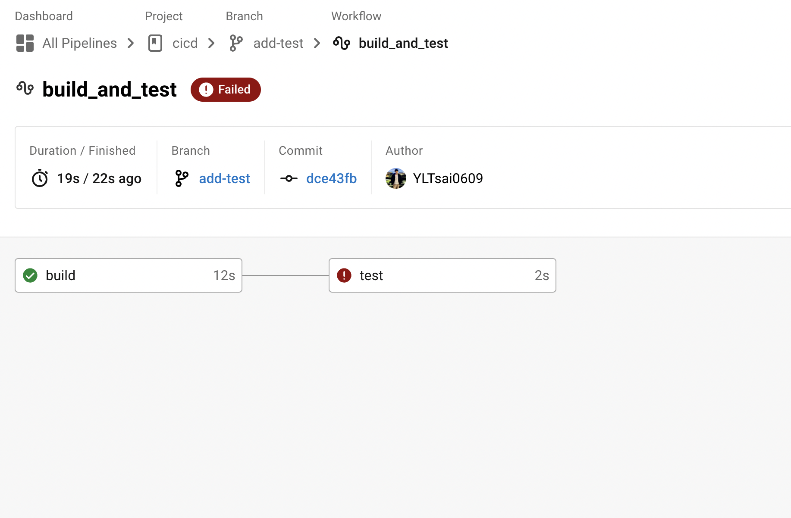

# Ref

[CircleCI 教程(Python 的 CircleCI 调度程序)](https://www.muyuanzhan.com/tutorials/python/2849.html)

[2022 CI/CD X Jenkins、CircleCI、Github Action 從把妹角度理解前後端如何和平相處](https://linyencheng.github.io/2022/10/10/relationships-between-frontend-and-backend/devops-ci-cd-jenkins-circleci-and-github-action/)

# 什麼是 CI/CD from 2022 CI/CD x Jenkins、CircleCI、...

* 確保程式碼再提交之後，減少因為少部分檯面下的更動，而影響程式碼運作，確保程式碼的品質

* CI (Continuous Integration)
  * 自動化測試和自動化建置
  * e.g. 更動推送到 Git Repo 時， Linter 和測試就會運作
  * 可確保每次推送的版本都是可以運作的，否則就會擋下來
  * Code --> Build --> Test
CD (Continuous Delivery/Deployment)
  * Test --> Release --> Deploy

* CI/CD 工具多元且通常自動化，常見的使用方法就是在專案中加入一個 yaml or README.md
* 安裝版 : DroneCI, Jenkins
* 第三方服務 : Travis CI, CircleCI
* 版控評台服務 : Github Action, Gitlab CI

# Hello World CircleCI

repo : https://github.com/YLTsai0609/cicd

https://www.muyuanzhan.com/tutorials/python/2849.html

</img>

check document @ https://circleci.com/docs/language-python/
