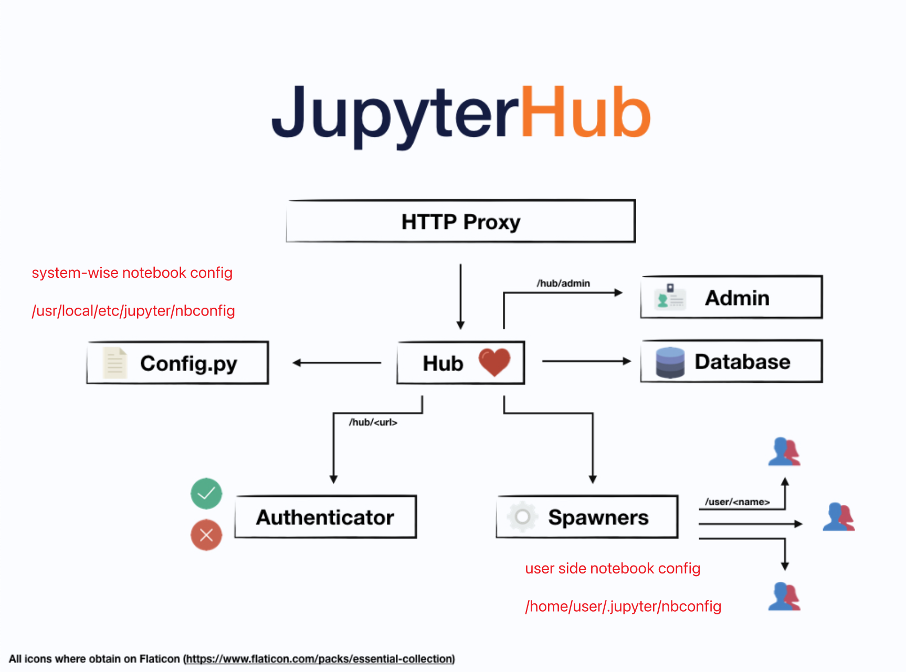

# Steps

1. 開一台虛擬機(e.g. gce)
2. 權限管理 
   - super users / developers
   - ssh
1. 共用 binary
   - conda, httpie, ag, ...
2. 工作環境
   - jupyterhub
   - spark / pyspark
   - flink / pyflink

# JupyterHub

[Install JupyterHub and JupyterLab from the ground up¶ Official](https://jupyterhub.readthedocs.io/en/1.2.1/installation-guide-hard.html)

## Install in system

* [follow the installation](https://jupyterhub.readthedocs.io/en/3.1.0/getting-started/config-basics.html#generate-a-default-config-file)
  * ubuntu 18.04 automantically use python3.6
  * please update pip from 9.x to 21.x to avoid `rust` XXX
  * [install node 16 for ubuntu 18.04](https://github.com/nodesource/distributions#deb), or we cannot `npm install configurable-http-proxy`
  * by defult we install jupyterhub == 2.3.1

### Trouble shooting

- cannot login with user name and password

```
c.LocalAuthenticator.create_system_users = True
# solved login only once
# https://stackoverflow.com/questions/73192732/cannot-log-in-with-user-to-jupyterhub-pam-authentication-failed
c.PAMAuthenticator.open_sessions = False


## Allow named single-user servers per user
#  Default: False
# c.JupyterHub.allow_named_servers = False
```

- can bew login with multiple users --> use sudo or [less privileges](https://github.com/jupyterhub/jupyterhub/wiki/Using-sudo-to-run-JupyterHub-without-root-privileges)
  - why not root? - isn't safe 
  - `sudo access restricted to launching and monitoring single-user servers.`
  - install systemwise python by [this](https://linuxize.com/post/how-to-install-python-3-8-on-ubuntu-18-04/) to make sure shawdo user can spawn notebook
    - `add to 2 lines /etc/sudoers`
    - `sudo groupadd jupyterhub` (開 group), `sudo usermod -a -G jupyterhub joetsai` (加到 group), `groups` 檢查 user groups,`groups rhea` 檢查 `rhea` 所在的 group ,  需要重新登入 - [ref](https://www.techrepublic.com/article/how-to-create-users-and-groups-in-linux-from-the-command-line/)
    - `sudo -u rhea python3 -c "import pamela, getpass; print(pamela.authenticate('$USER', getpass.getpass()))"`
    - a lot of error - still a mystery....

# Docker Solution

[official](https://hub.docker.com/r/jupyterhub/jupyterhub)
* hub only, need to install jupyter 5+
* ssl proxy
* mounting volumes so that you can store data outside the hot system

## Third-party Solution II (anaconda + systemd)

https://stackoverflow.com/questions/50113995/how-to-run-jupyterhub-using-sudo-error-commad-not-found


# Third-party Solution I (Deprecated)

video : https://www.youtube.com/watch?v=KHvol5qN-dM

tutorial on google : https://tljh.jupyter.org/en/latest/install/google.html

github : https://github.com/jupyterhub/the-littlest-jupyterhub


## add new user
* admin add it in jupyterhub GUI
  * users will crwate a folder as `/home/jupyter-username`
  * need to link to its own folder
* admin add it in linux useradd
  * sudo useradd {{username}}
  * sudo passwd {{username}}
  * sudo ln -s /home/username /home/jupyter-username (create symbol link in /home/jupyter-username)


## jupyter extension

1. https://jupyter-contrib-nbextensions.readthedocs.io/en/latest/install.html
   1. `conda install -c conda-forge jupyter_contrib_nbextensions`
   2. `conda install -c conda-forge jupyter_nbextensions_configurator`

cmd : `jupyter contrib nbextension install --user`
* 都裝在 user 下 `e.g. /home/username/.jupyter/jupyter_nbconvert_config.json`

cmd : `jupyter nbextensions_configurator enable --user`
* 開啟 UI

- **SO FAR - not systemwise**
- 
## Legacy

0. [check root access](https://superuser.com/questions/553932/how-to-check-if-i-have-sudo-access)
1. we don't have permission in /opt/, we use ~/jupyterhub
   1. `.venv/bin/pip install -U pip` - to prevent missing rust dependency
   2. `.venv/bin/pup install wheel jupyterhub jupyterlab ipywidgets`
   3. `sudo apt install nodejs npm`
      1.`which nodejs`, `which npm` (nodejs 以及他的管理工具)
# JupyterHub WorkStation

</img> 

[Implementation by docker/gcloud](https://github.com/YLTsai0609/jupyter_workstation)


# Comparsion

## [VertexAI - WorkBench](https://cloud.google.com/vertex-ai/docs/workbench/user-managed/introduction)

pros : 
* easier to getting start (pre installed package)
* integrated with GCP service(scheduling, feature store , ...)

cons : 
* 3rd jupyterlab extension is not supported (nbextension, templates)
* not ssh accessable for the respceted VM


## jupyterhub (install from scrach) + GCE

pros : 

* customized
  * nb-extension supported.
  * ssh accesaable
  * not user mapping issue between host and container

cons : 
* dirty work
* resource management is not the best option compare with each instance.

## jupyterhub (Docker) + GCE

pros : 

* customized
  * nb-extension supported.

cons : 
* more knowledge about docker
* user mapping issue between host and container


