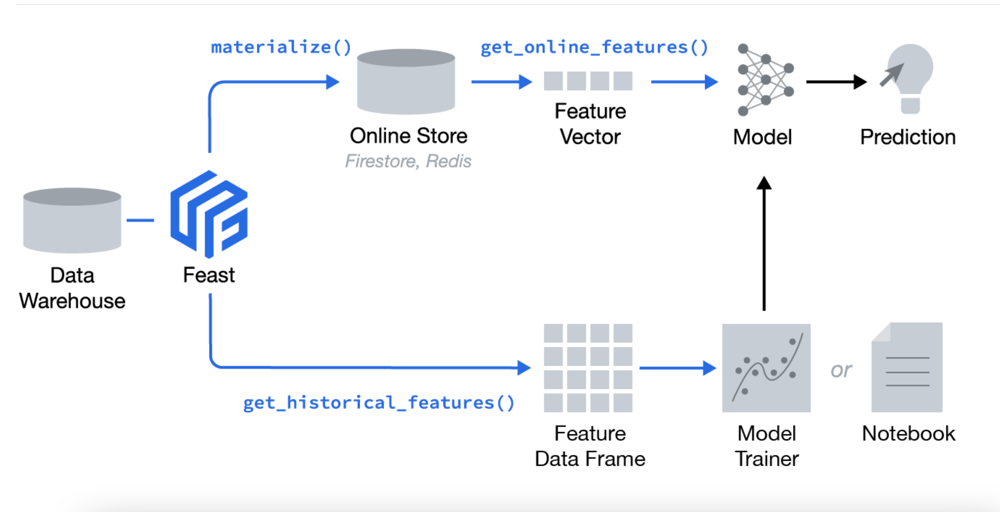
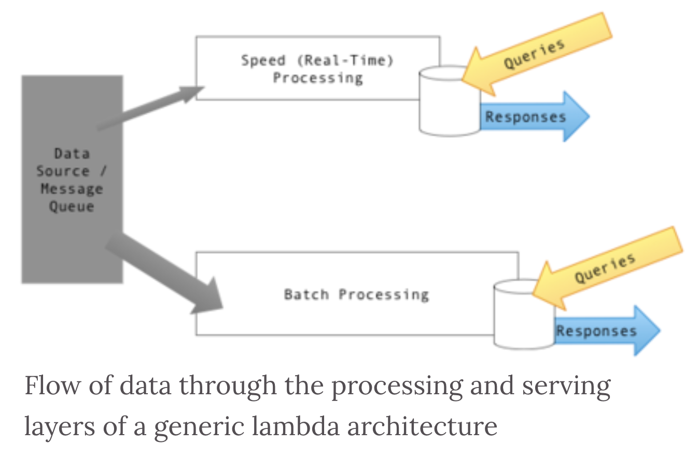
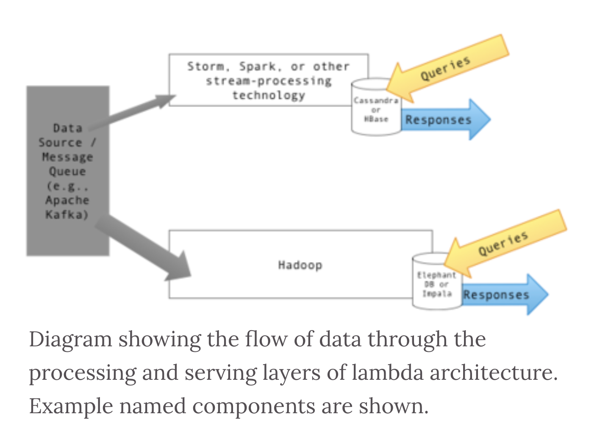
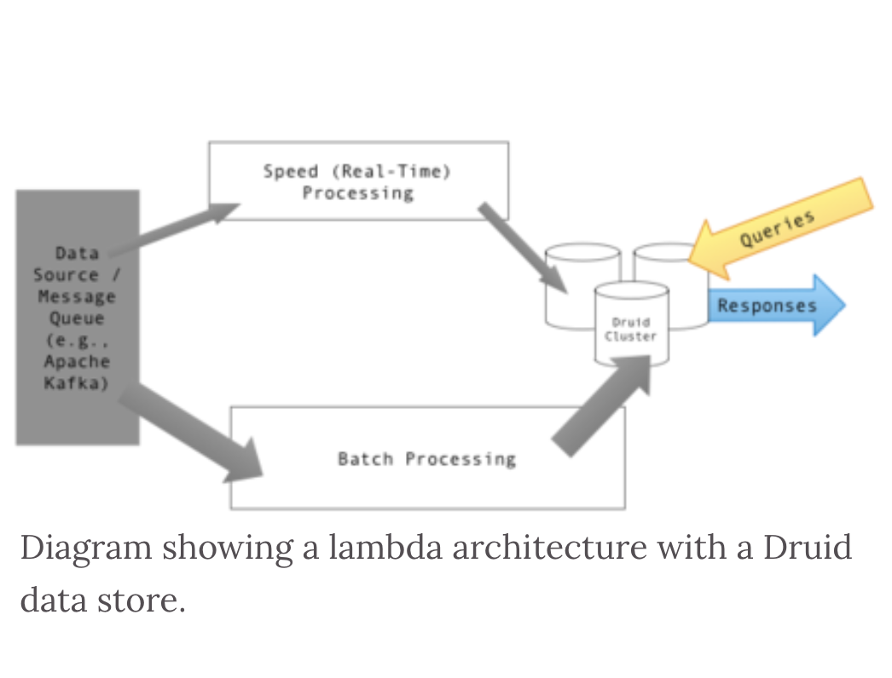
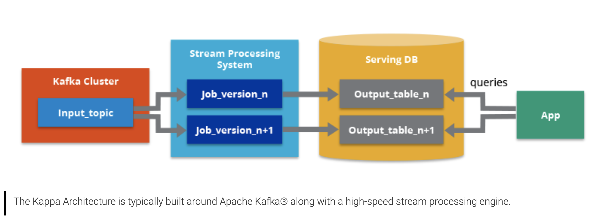

# Why

[Fwature Store - dwast python package](https://github.com/feast-dev/feast)

</img>

Feature Store 是一種設計模式，主要是建立一個抽象層，在Data Warehouse 之上，可以讓開發者/科學家可以直接取得 historical(offline), online 的特徵，快速用於分析及建立模型

主要解決的痛點是，現今(2021)，offline 和 online 的 data pipeline 通常是分開設計的，這使得兩者產出的資料不一定會一致的Schema，且online store通常要具有低延遲的特性

Feature Store 這個設計模式率先處理了這類的問題

而 `feast` 其實就是這個設計理念的其中一種實作(整合 schema)，這個概念其實被稱作 `lambda architecture` (?)

# Lambda Architecture

[**Lambda architecutre**](https://www.wikiwand.com/en/Lambda_architecture) is a data-processing architecture designed to handle massive quantities of data by taking advantage of both `batch` and `stream-processing` method.

The approach to architecture attempts to balance `latency, throughput`, and `fault-tolerance` by using btach processing to provide comprehensive and accurate views of btach data,
while simulataneously using real-time stream processing to provide views of online data.

The two view output may be joined before presentation.

</img>

## Batch layer

batch layer precomputes result using distributed processing system that xan handle very large quantities of data.

1. fault-tolerance based on recompting the dataset.
2. large scale
3. slow

often output as read-only database.

leading tech : Hadoop, Snowflake, Redshift, BigQuery.

## Speed Layer

speed layer processes data stream in `realtime` and without the requirements of fix-ups or completeness.

This layer sacrifices `throughput` as it aims to minimize lantency by providing real-time views in the most recent data.

output is typically stored on fast NoSQL databases.

lead tech : 

Storm, SQLstream, Samaza, Spark, Stream Analytics, 

</img>

## Serving Layer

Output from the batch and speed layers are store in the serving layer, which responds to ad-hoc query by returning precomputed and realtime-rpcoessed data.

</img>

leading tech : 

Druid, Cassandra, HBase, Cosmos DB, MongoDB, VoltDB, Elastissearch.

## Criticism

1. require a different code base in batch / speed layer

# Kappa Architecture

perform both real-time and batch processing, **with single technology stack.**

</img>

lead tech : Kafka

# 比較 (To be reviewed)

arct|pros|cons
-----|-----|-----
lambda|架構簡單|speed, batch layer 難以保持一致結果
lambda|良好結合 batch processing, streamming processing 的優點|要維護兩套|
lambda|離線資料易於修正||
kappa|speed layer|強依賴於對中間物件緩存能力|
kappa|event 可以重放|可能丟掉數據?|
lambda|無需合併 offline 數據||

[ref](https://acrofrank-b.github.io/post/lambda-jia-gou-vs-kappa-jia-gou/)

