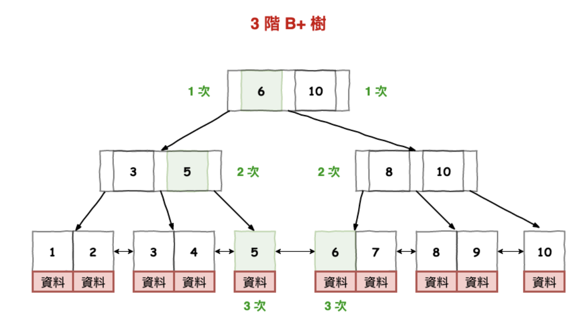

# Primary Key
* Primary Key - PK, UK, 資料庫中對儲存資料已唯一完整標示 - 只能有一個 PK
  * e.g. customerID, poi_id, xxx_id, 不能為 Null
  * SELECT COUNT(DISTINCT PK) = COUNT(*)
* Entity - 多個欄位組成，用於識別一張資料表的最小單元 (records), e.g. customerID, timestamp (每個customerID 在 timestamp 下的行為) - OLAP 上的麻煩事
  * SELECT COUNT(DISTINCT CONCAT(C1, C2, ...)) WHERE C1, C2, ... IS NOT NULL = COUNT(*)
* pseudokey - auto-increament key - 用於當作 PK
  * 
* 通常 PK 的選擇會以最常使用的查詢方式 (過往是 OLTP 最常用的查詢方式，例如 userID 會查詢 SELECT * WHERE userID = 'u1', 訂單明細則會用 訂單編號、項次)
  * 在 PK 上建立 INDEX 來加速查詢

# Index

* DB 中一種加速查詢的操作方式，通常背後是以樹的結構儲存，大部分以 B+ Tree 為主 - 是一種特別平衡樹高度，以便維持查詢效率的樹結構 (MySQL 默認儲存引擎是 InnoDB)

## BST(BInary Search Tree), AVL Tree, BTree, B+ Tree

[資料庫的索引(Index)工作原理](https://wenwender.wordpress.com/2022/08/26/%E8%B3%87%E6%96%99%E5%BA%AB%E7%9A%84%E7%B4%A2%E5%BC%95index%E5%B7%A5%E4%BD%9C%E5%8E%9F%E7%90%86/)

[30-11 之資料庫層的核心 - 索引結構演化論 B+樹](https://ithelp.ithome.com.tw/articles/10221111)

* BST - 仍然可能會退化成 Linked-List - 搜尋效率變差 O(N)
* Balanced BSTree
  * 搜尋效率已經很好了，但因為深度會很深，放在硬碟會導致太多次 IO
* [B Tree]((https://zh.wikipedia.org/zh-tw/B%E6%A0%91))
  * 每個硬碟的 block ，放一個子樹 (減少 IO 次數)
* [B+ Tree](https://zh.wikipedia.org/zh-tw/B%2B%E6%A0%91)
  * B Tree 的查詢不穩定
  * B Tree 的範圍搜尋不太好

# Blanced BST vs BTree
</img>

# BTree

</img>

# BTree vs B+Tree

</img>

</img>

</img>

B Tree 樹的高度可以維持，但插入的順序會影響樹的長法

B+ Tree - 中間節點會多，資料只存在最後的葉子節點，確保搜尋效率穩定，且每個節點都可以 Binary Search

* 搜尋效率 tc : O(logN)
* 插入資料、刪除資料 tc : O(logN)
* 空間複雜度 : O(N)

When to use

* 資料量體大 (e.g. > 500GB)， 經常透過透定欄位來查找資料 (e.g. ID)
  * 花費額外空間，加速搜尋 - OLTP 常用
  * 如果需求是 Write > Read 而造成的慢，那摩不該建立 Index - 應當讀寫分離

# Partition / Sharding

[https://homuchen.com/posts/what-is-database-partition-sharding/](https://homuchen.com/posts/what-is-database-partition-sharding/)

* Vertical / Horizontal
  * 根據欄位，拆出去之後 schema 會不同
  * 根據列 / schema 相同，子集合 - OLAP 常用
* 是一種資料管理的方式，建立 Partition 後，也會使 query 效能大幅改善 (如果沒有和 Index 混用的情況下)
* 

</img>

* Partitioning - 大表拆成小表，常見使用日期，或者易於商業邏輯判斷的維度，例如國家
  * 容易將冷熱資料分開
* 查詢規則不需要大幅變動 - WHERE PARTITION BETWEEN A AND B
* INDEX 存在的 scope 於單表中，而非分區表

# Partition vs Index

* 一般來說， OLAP (DataWarehouse / DataLake) 採用日期或者時間戳記做 Partition
  *  OLAP 基本上是唯讀，不做 Update， 不做刪除
  *  需求通常來自於少次讀取，每次大量或者少量時間跨度
*  OLTP 更常使用 Index， CRUD 都會有，但除了備份以外，經常以單筆資料 (single user, single order)，或者小範圍資料 (10~20+ page data) 來查詢
*  如果 OLTP 的事實表有做 Update by timestamp，那麼就表示該資料表，並非單調增加，這是資料同步上要注意的

# Partitioning Strategy in for data-lake

4 mode : 

1. overwrite
2. append
3. dynamic partition overwrite
4. merge

[ref - Handling Dynamic Partitioning and Merge with Spark on BigQuery](https://starlake-ai.github.io/starlake/blog/spark-big-query-partitioning/)

