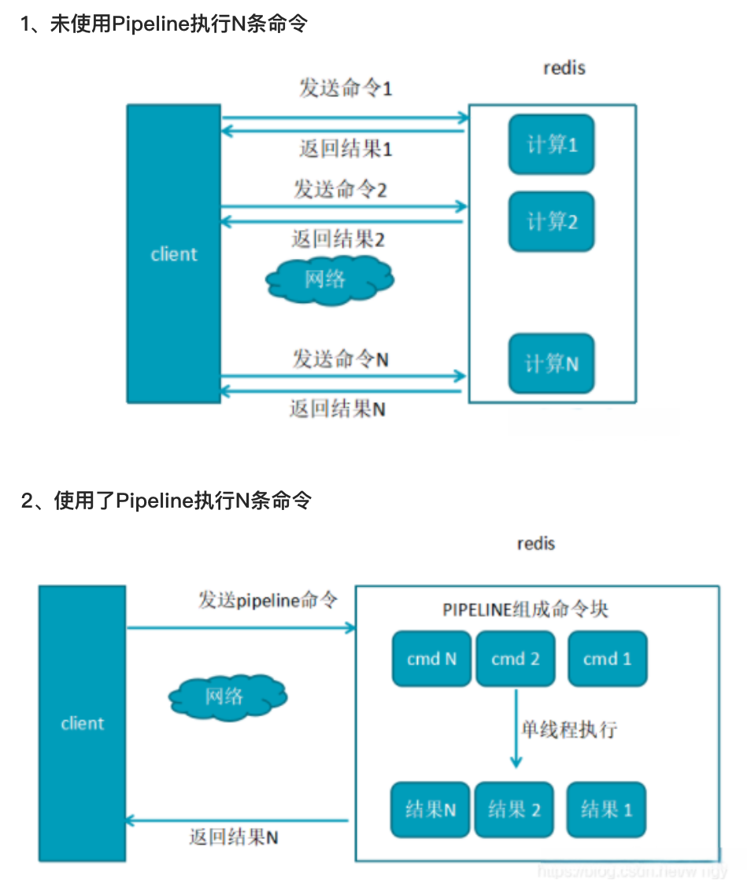

# Redis

[Introduction to Redis](https://redis.io/docs/about/)

* in nemory data structure store 
  * strings/hashes/list/set/sorted sets
  * counting - bitmaps, hyperloglogs, geospatial indexes
* cache
  * LRU
  * on-disk persistence
* message broker
* streaming engine

* HA(high avaliability) with redis cluster


* `redis-cli`
* [`python client`](https://github.com/redis/redis-py)

## Getting Start

[Install Redis on macOS](https://redis.io/docs/getting-started/installation/install-redis-on-mac-os/)

`brew install redis`

* maybe install at `/opt/homebrew/opt/redis/bin/redis-server /opt/homebrew/etc/redis.conf`

`which redis-server`

`which redis-cli`

`brew services start redis` - start service

`ps aux | ag 6379` - check service is running

`redis-cli` - check in to the database

or using python client : `python redis_py/redis_cache.py`

## Redis 16 db

[Redis 爲什麼要分 16 個庫](https://www.readfog.com/a/1636087731802181632)

* single machine : `db0` ~ `db15`
* cluster : only `db0`

* different - `db` (like different tables)
  * `redis/redis.conf` - databases 16 (可設定數量)
  * 不能設定不同 db 的密碼
  * flushall - 全數清空


# Redis-cli

command|means|note
-----|-----|-----
KEYS *|show all the keys||
KEYS N*|pattern match N*||
SELECT 15|select db no 15||
redis-cli FLUSHALL|flush all data cross redisdatabase||
redis-cli FLUSHDB|flush all data in specified redisdatabase||


# Redis 批量讀寫

## pipeline

[ref - Redis 性能優化 : 理解與使用 Redis](https://cnblogs.com/booksea/p/17760046.html)

[ref - Redis如何解决频繁的命令往返造成的性能瓶颈](https://zhuanlan.zhihu.com/p/331880996)

1. single term : `set`, `get`
2. batch : pipeline to set and pipeline to get (<100 ms reading)
3. 頻繁 Network IO, 會導致巨大 latency

* pipeline - 組個多個命令，一次送出，類似 query

Redis client 執行命命令的 4 個步驟

1. 發送 command
2. command 排隊
3. command 執行
4. return 

round trip time - 總共反應時間

</img>

優點 : 節省時間，快速取得結果
缺點 & 注意事項 : 

1. pipeline 是同步 request, response, 每次 batch 應當小於 10k 筆，不然網路會卡住
2. 執行過程中，一個 command 異常，其他的會繼續執行，不具備 atomic (允許一定比例的失敗，例如群發簡訊 10k 筆，漏掉 3 筆沒關係)

* 怎麼測試?

```python
redis-benchmark -t set -q
```

* 支援 localhost & remote, pipeline 模式等
* 也可以自己寫 python scripts，進行測試，先做 set, 在做 get

## MGet, MSet

https://www.runoob.com/redis/strings-mget.html

可以做 batch load, batch dump

mset，mget操作在Redis队列中是一个原子操作，pipeline不是原子操作
mset，mget操作一个命令对应多个键值对，而pipeline是多条命令
mset，mget是服务端实现，而pipeline是服务端和客户端共同完成

[command 大補帖](https://codingnote.cc/zh-tw/p/702119/)

## Trouble shooting

1. redis key without expire-time, we wanna expire them.

```python
for key in redis.keys('*'):
    if redis.ttl(key) == -1:
        redis.expire(key, 60 * 60 * 24 * 7)
        # This would clear them out in a week
```

ttl - time to live (in secs)

2. set is slow

* https://medium.com/gojekengineering/how-we-pushed-a-million-keys-to-redis-in-seconds-b99020e7cb0f

# [Redis 基本資料型別](https://medium.com/happy-friday/%E5%88%9D%E8%AD%98-redis-%E4%BA%94%E5%A4%A7%E8%B3%87%E6%96%99%E5%9E%8B%E5%88%A5-3c67c05238d0)

String, List, Set, Hash, Sorted Set


