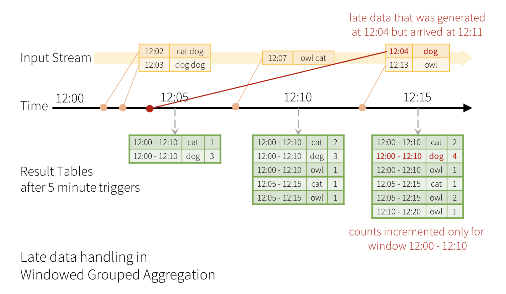

# 結構化串流基礎

Data Stream --> continously appended dataframe.

input & output
* MQ, such as apache kafka
* static files
* socket source

output mode : 

* append
* update by key
* overwrite

example : 

**read**

```python

    streaming = (
        spark.readStream.schema(data_schema)
             .json("data/activity/*.json")
    )

    stream_count = streaming.groupBy('gt').count()
```

**write**

```python
    out_stream = (
        stream_count.writeStream.queryName('activity_count')
        .format('memory')
        .outputMode('complete')
    )
```
# 事件時間和狀  態管理
## event-time, arrival-time, watermark

</img>

* time window interval (batch interval) : 10mins
* sliding tirgger : 5 mins
* watermark : 5 hours - 12:05的資料，只要 event-time落在 12:00~12:05 之間的 event ，可以容忍 arrival-time 差距5小時
* 資料會因為遲到、重複發送而產生亂序

```python
with_evnettime_sdf = stream.selectExpr(
    "*",
    # 奈秒(ns)
    "cast(cast(event_time as double) / 10e-9 as timestamp) as event_time"
)

out_stream_sdf = (
    with_eventtime_sdf
    .withWatermark('event_time',"5 hours")
    .dropDuplicates("event_time","animal") 
    # if you want to drop duplicates (event re-sent)
    .groupBy(
        Window(
            event_time,
            '10 mins', # batch interval
            '5 mins' # sliding trigger
         ),
        'animal'
    )
    .agg(
        F.count('*').alias('cnt')
    )
    .writeStream
    .queryname('animal_counts_per_window')
    .format('memory')
    .outMode('complete')

)

out_stream_sdf.start()
```

## 容錯性

* At most once - 每個紀錄會被處理一次或是不處理
* **At lease once** - 每個紀錄或被處理一次或是多次(因為發送端常常會因為確保資料有發送出去，而多次發送)
* Exactly once - 精確處理一次，不丟失

# Process with State

* select, explode, map, filter, where, ...

# Process without State

* such as groupBy
# Ref

[Spark技術手冊：輕鬆寫意處理大數據 - Chp21 結構化串流基礎](https://www.books.com.tw/products/0010837191)

[四、Structured Streaming的事件-时间（Event-time）和延迟数据 （Late Data）](https://blog.csdn.net/s294878304/article/details/100633702)

[【秒懂StructuredStreaming】StructuredStreaming是何方神圣](https://blog.csdn.net/lovechendongxing/article/details/81748237?spm=1001.2101.3001.6661.1&utm_medium=distribute.pc_relevant_t0.none-task-blog-2%7Edefault%7ECTRLIST%7ERate-1-81748237-blog-100633702.pc_relevant_multi_platform_whitelistv3&depth_1-utm_source=distribute.pc_relevant_t0.none-task-blog-2%7Edefault%7ECTRLIST%7ERate-1-81748237-blog-100633702.pc_relevant_multi_platform_whitelistv3&utm_relevant_index=1)

[Spark从入门到精通（10）：结构化流(Structured Streaming)（中）](https://zhuanlan.zhihu.com/p/394719245)